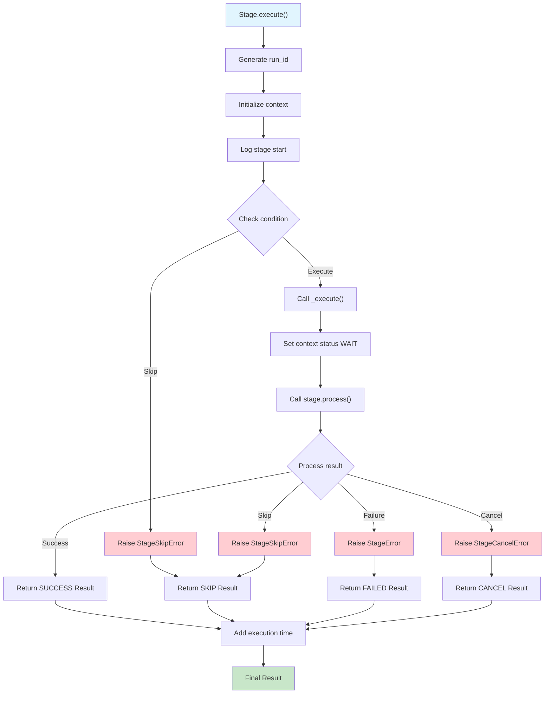
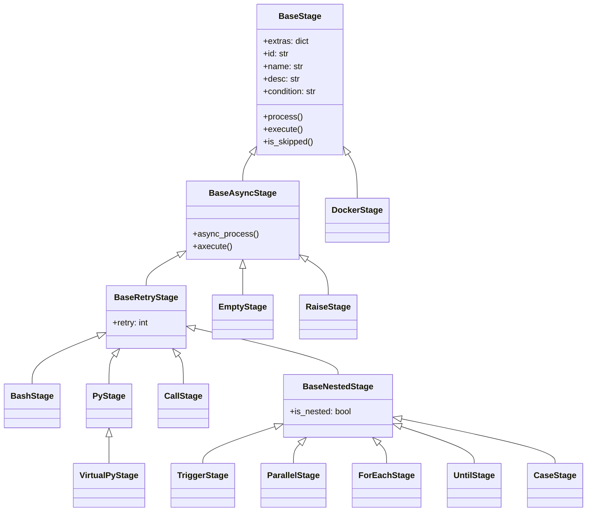

# Stages

The Stages module provides the core execution layer for workflow tasks. Stages are the smallest executable units that run within a single thread and handle specific operations like script execution, function calls, data processing, and workflow orchestration.

## Overview

Stages are the fundamental building blocks of workflows, providing:

- **Atomic execution**: Each stage runs as a single unit with clear inputs/outputs
- **Error isolation**: Stage failures are contained and don't affect other stages
- **Flexible execution**: Support for various execution environments and languages
- **Conditional logic**: Dynamic execution based on parameters and context
- **Retry mechanisms**: Automatic retry on failures with configurable policies

## Stage Execution Flow



## Quick Start

```python
from ddeutil.workflow.stages import EmptyStage, BashStage, PyStage

# Simple echo stage
stage = EmptyStage(
    name="Hello World",
    echo="Starting workflow execution"
)

# Bash script execution
bash_stage = BashStage(
    name="Process Data",
    bash="echo 'Processing...' && ls -la /data"
)

# Python code execution
py_stage = PyStage(
    name="Data Analysis",
    run="""
import pandas as pd
df = pd.read_csv('/data/input.csv')
result = len(df)
print(f"Processed {result} rows")
""",
    vars={"input_file": "/data/input.csv"}
)
```

## Stage Types Summary

| Stage Type | Purpose | Use Case | Inheritance |
|------------|---------|----------|-------------|
| `EmptyStage` | Logging and delays | Debugging, notifications, timing | `BaseAsyncStage` |
| `BashStage` | Shell script execution | File operations, system commands | `BaseRetryStage` |
| `PyStage` | Python code execution | Data processing, API calls, analysis | `BaseRetryStage` |
| `VirtualPyStage` | Python in virtual env | Isolated Python execution | `PyStage` |
| `CallStage` | Function calls | Reusable business logic | `BaseRetryStage` |
| `TriggerStage` | Workflow orchestration | Multi-workflow pipelines | `BaseNestedStage` |
| `ParallelStage` | Concurrent execution | Performance optimization | `BaseNestedStage` |
| `ForEachStage` | Iterative processing | Batch operations | `BaseNestedStage` |
| `CaseStage` | Conditional execution | Branching logic | `BaseNestedStage` |
| `UntilStage` | Retry loops | Polling, retry logic | `BaseNestedStage` |
| `RaiseStage` | Error simulation | Testing, error handling | `BaseAsyncStage` |
| `DockerStage` | Container execution | Containerized workloads | `BaseStage` |

## Stage Class Hierarchy



## Base Classes

### BaseStage

Abstract base class for all stage implementations.

!!! info "Key Features"
    - Common stage lifecycle management
    - Parameter templating and validation
    - Error handling and retry logic
    - Output collection and context management

#### Attributes

| Attribute | Type | Default | Description |
|-----------|------|---------|-------------|
| `id` | str \| None | `None` | Unique stage identifier for output tracking |
| `name` | str | Required | Human-readable stage name for logging |
| `desc` | str \| None | `None` | Stage description for documentation |
| `condition` | str \| None | `None` | Conditional expression for execution |
| `extras` | dict | `{}` | Additional configuration parameters |

#### Methods

##### `execute(params, run_id, context, *, parent_run_id=None, event=None)`

Execute the stage with provided parameters.

**Parameters:**
- `params` (dict): Parameter values for stage execution
- `run_id` (str): Unique execution identifier
- `context` (dict): Execution context from previous stages
- `parent_run_id` (str, optional): Parent workflow run identifier
- `event` (Event, optional): Threading event for cancellation

**Returns:**
- `Result`: Stage execution result with status and outputs

##### `is_skipped(params)`

Check if stage should be skipped based on condition.

**Parameters:**
- `params` (dict): Current parameter context

**Returns:**
- `bool`: True if stage should be skipped

### BaseAsyncStage

Base class for stages with async execution capabilities.

#### Methods

##### `async_process(params, run_id, context, *, parent_run_id=None, event=None)`

Async execution method that must be implemented by subclasses.

##### `axecute(params, *, run_id=None, event=None)`

Async handler for stage execution with error handling.

### BaseRetryStage

Base class for stages with retry capabilities.

#### Attributes

| Attribute | Type | Default | Description |
|-----------|------|---------|-------------|
| `retry` | int | `0` | Number of retry attempts on failure |

### BaseNestedStage

Base class for stages that contain other stages.

#### Properties

| Property | Type | Description |
|----------|------|-------------|
| `is_nested` | bool | Always returns `True` for nested stages |

## Stage Implementations

### Empty Stage

Empty stage executor that logs messages and optionally delays execution.

!!! example "Empty Stage Usage"

    === "Basic Logging"

        ```yaml
        stages:
          - name: "Start Processing"
            echo: "Beginning data pipeline execution"
        ```

    === "With Delay"

        ```yaml
        stages:
          - name: "Wait for System"
            echo: "Waiting for system to be ready..."
            sleep: 30
        ```

    === "Conditional Execution"

        ```yaml
        stages:
          - name: "Debug Info"
            if: "${{ params.debug_mode == true }}"
            echo: "Debug mode enabled - showing detailed logs"
        ```

#### Attributes

| Attribute | Type | Default | Description |
|-----------|------|---------|-------------|
| `echo` | str \| None | `None` | Message to log to stdout |
| `sleep` | float | `0` | Seconds to sleep before execution (0-1800) |

#### Use Cases

- **Debugging**: Add logging points to track workflow progress
- **Timing**: Introduce delays for system synchronization
- **Notifications**: Log important events or milestones
- **Conditional Logic**: Execute based on parameter values

### Bash Stage

Bash stage executor for shell script execution.

!!! warning "Security Considerations"
    - Scripts run with system permissions
    - Validate all inputs to prevent injection attacks
    - Consider using `PyStage` for complex logic
    - Avoid executing untrusted scripts

!!! example "Bash Stage Usage"

    === "Simple Command"

        ```yaml
        stages:
          - name: "Check Disk Space"
            bash: "df -h /data"
        ```

    === "With Environment Variables"

        ```yaml
        stages:
          - name: "Process Files"
            env:
              INPUT_DIR: "/data/input"
              OUTPUT_DIR: "/data/output"
            bash: |
              echo "Processing files in $INPUT_DIR"
              ls -la "$INPUT_DIR"
              mkdir -p "$OUTPUT_DIR"
        ```

    === "Error Handling"

        ```yaml
        stages:
          - name: "Safe File Operation"
            bash: |
              set -e  # Exit on any error
              if [ ! -f "/data/input.csv" ]; then
                echo "Input file not found"
                exit 1
              fi
              echo "Processing input file..."
        ```

#### Attributes

| Attribute | Type | Default | Description |
|-----------|------|---------|-------------|
| `bash` | str | Required | Bash script to execute |
| `env` | dict[str, Any] | `{}` | Environment variables for script |
| `retry` | int | `0` | Number of retry attempts on failure |

#### Limitations

- **Multiline scripts**: Complex multiline scripts are written to temporary files
- **Cross-platform**: Windows requires WSL or bash compatibility
- **Error handling**: Script errors must be handled explicitly
- **Output parsing**: Script output is captured as strings

### Python Stage

Python stage for executing Python code with full access to installed packages.

!!! warning "Security Warning"
    - Uses `exec()` function which can be dangerous
    - Validate all code before execution
    - Consider using `CallStage` for production code
    - Avoid executing untrusted code

!!! example "Python Stage Usage"

    === "Basic Python"

        ```yaml
        stages:
          - name: "Data Analysis"
            run: |
              import pandas as pd
              import numpy as np

              df = pd.read_csv('/data/input.csv')
              summary = df.describe()
              print(f"Dataset shape: {df.shape}")
        ```

    === "With Variables"

        ```yaml
        stages:
          - name: "Process Data"
            vars:
              input_file: "/data/input.csv"
              threshold: 1000
            run: |
              import pandas as pd

              df = pd.read_csv(input_file)
              if len(df) > threshold:
                  print(f"Large dataset: {len(df)} rows")
              else:
                  print(f"Small dataset: {len(df)} rows")
        ```

    === "Error Handling"

        ```yaml
        stages:
          - name: "Safe Processing"
            run: |
              try:
                  import pandas as pd
                  df = pd.read_csv('/data/input.csv')
                  result = len(df)
                  print(f"Successfully processed {result} rows")
              except Exception as e:
                  print(f"Error processing data: {e}")
                  raise
        ```

#### Attributes

| Attribute | Type | Default | Description |
|-----------|------|---------|-------------|
| `run` | str | Required | Python code to execute |
| `vars` | dict[str, Any] | `{}` | Variables available in execution context |
| `retry` | int | `0` | Number of retry attempts on failure |

#### Best Practices

- **Import statements**: Place imports at the top of the code block
- **Error handling**: Use try-catch blocks for robust execution
- **Output**: Use `print()` for logging, return values for data
- **Dependencies**: Ensure required packages are installed
- **Security**: Validate all inputs and avoid `eval()` or `exec()`

### Virtual Python Stage

Virtual Python stage for executing Python code in isolated virtual environments using `uv`.

!!! example "Virtual Python Stage Usage"

    === "Basic Virtual Environment"

        ```yaml
        stages:
          - name: "Isolated Analysis"
            version: "3.11"
            deps: ["pandas", "numpy", "matplotlib"]
            run: |
              import pandas as pd
              import numpy as np

              df = pd.DataFrame(np.random.randn(100, 4))
              print(f"Generated dataset: {df.shape}")
        ```

#### Attributes

| Attribute | Type | Default | Description |
|-----------|------|---------|-------------|
| `run` | str | Required | Python code to execute |
| `vars` | dict[str, Any] | `{}` | Variables available in execution context |
| `version` | str | `"3.9"` | Python version for virtual environment |
| `deps` | list[str] | Required | Python dependencies to install |
| `retry` | int | `0` | Number of retry attempts on failure |

### Call Stage

Call stage for executing registered functions with arguments.

!!! example "Call Stage Usage"

    === "Basic Function Call"

        ```yaml
        stages:
          - name: "Process Data"
            uses: "tasks/process_csv@latest"
            with:
              input_path: "/data/input.csv"
              output_path: "/data/output.parquet"
        ```

    === "With Complex Arguments"

        ```yaml
        stages:
          - name: "API Call"
            uses: "api/send_notification@v1"
            with:
              message: "Workflow completed successfully"
              recipients: ["admin@example.com"]
              priority: "high"
              metadata:
                workflow_id: "${{ params.workflow_id }}"
                execution_time: "${{ params.execution_time }}"
        ```

    === "Conditional Call"

        ```yaml
        stages:
          - name: "Send Alert"
            if: "${{ params.send_alerts == true }}"
            uses: "notifications/send_alert@production"
            with:
              level: "${{ params.alert_level }}"
              message: "Data processing completed"
        ```

#### Attributes

| Attribute | Type | Default | Description |
|-----------|------|---------|-------------|
| `uses` | str | Required | Function reference in format `module/function@tag` |
| `args` | dict[str, Any] | `{}` | Arguments passed to the function |
| `retry` | int | `0` | Number of retry attempts on failure |

#### Function Registration

Functions must be registered using the `@tag` decorator:

```python
from ddeutil.workflow import tag

@tag("tasks", alias="process_csv")
def process_csv_file(input_path: str, output_path: str) -> dict:
    """Process CSV file and convert to Parquet format."""
    import pandas as pd

    df = pd.read_csv(input_path)
    df.to_parquet(output_path)

    return {
        "rows_processed": len(df),
        "output_size": output_path
    }
```

### Trigger Stage

Trigger stage for orchestrating other workflows.

!!! example "Trigger Stage Usage"

    === "Simple Trigger"

        ```yaml
        stages:
          - name: "Run Data Pipeline"
            trigger: "data-pipeline"
            params:
              date: "${{ params.processing_date }}"
              environment: "production"
        ```

    === "With Complex Parameters"

        ```yaml
        stages:
          - name: "Multi-Environment Deploy"
            trigger: "deployment-workflow"
            params:
              application: "web-app"
              environments: ["dev", "staging", "prod"]
              version: "${{ params.app_version }}"
              rollback_on_failure: true
        ```

#### Attributes

| Attribute | Type | Default | Description |
|-----------|------|---------|-------------|
| `trigger` | str | Required | Name of workflow to trigger |
| `params` | dict[str, Any] | `{}` | Parameters passed to triggered workflow |

### Parallel Stage

Parallel stage for concurrent execution of multiple stages.

!!! example "Parallel Stage Usage"

    === "Basic Parallel Execution"

        ```yaml
        stages:
          - name: "Parallel Processing"
            parallel:
              branch01:
                - name: "Process Region A"
                  bash: "process_data.sh --region=us-east"
                - name: "Validate Region A"
                  uses: "validation/check_data@latest"
              branch02:
                - name: "Process Region B"
                  bash: "process_data.sh --region=us-west"
        ```

    === "With Shared Context"

        ```yaml
        stages:
          - name: "Multi-Service Health Check"
            max-workers: 3
            parallel:
              database:
                - name: "Check Database"
                  uses: "health/database_check@latest"
                  with:
                    host: "${{ params.db_host }}"
              api:
                - name: "Check API"
                  uses: "health/api_check@latest"
                  with:
                    endpoint: "${{ params.api_url }}"
              cache:
                - name: "Check Cache"
                  uses: "health/cache_check@latest"
                  with:
                    redis_url: "${{ params.redis_url }}"
        ```

#### Attributes

| Attribute | Type | Default | Description |
|-----------|------|---------|-------------|
| `parallel` | dict[str, list[Stage]] | Required | Mapping of branch names to stage lists |
| `max_workers` | int | `2` | Maximum number of concurrent workers (1-20) |

### ForEach Stage

ForEach stage for iterative processing of collections.

!!! example "ForEach Stage Usage"

    === "Process File List"

        ```yaml
        stages:
          - name: "Process Files"
            foreach: "${{ params.file_list }}"
            concurrent: 2
            stages:
              - name: "Process ${{ item }}"
                bash: "process_file.sh '${{ item }}'"
        ```

    === "Matrix Processing"

        ```yaml
        stages:
          - name: "Multi-Environment Deploy"
            foreach: "${{ params.environments }}"
            stages:
              - name: "Deploy to ${{ item }}"
                uses: "deploy/application@latest"
                with:
                  environment: "${{ item }}"
                  version: "${{ params.app_version }}"
        ```

    === "With Index"

        ```yaml
        stages:
          - name: "Process with Index"
            foreach: ["a", "b", "c"]
            use-index-as-key: true
            stages:
              - name: "Process item ${{ item }} at index ${{ loop }}"
                echo: "Processing item ${{ item }} (index: ${{ loop }})"
        ```

#### Attributes

| Attribute | Type | Default | Description |
|-----------|------|---------|-------------|
| `foreach` | Union[list, str] | Required | Items to iterate over |
| `stages` | list[Stage] | Required | Stages to execute for each item |
| `concurrent` | int | `1` | Number of concurrent executions (1-10) |
| `use_index_as_key` | bool | `False` | Use loop index as key instead of item value |

### Case Stage

Case stage for conditional execution based on parameter values.

!!! example "Case Stage Usage"

    === "Environment-Specific Logic"

        ```yaml
        stages:
          - name: "Environment Setup"
            case: "${{ params.environment }}"
            match:
              - case: "development"
                stages:
                  - name: "Setup Dev Environment"
                    bash: "setup_dev.sh"
              - case: "staging"
                stages:
                  - name: "Setup Staging Environment"
                    bash: "setup_staging.sh"
              - case: "production"
                stages:
                  - name: "Setup Production Environment"
                    bash: "setup_prod.sh"
              - case: "_"
                stages:
                  - name: "Default Setup"
                    bash: "setup_default.sh"
        ```

    === "Error Handling Cases"

        ```yaml
        stages:
          - name: "Error Recovery"
            case: "${{ params.error_type }}"
            match:
              - case: "network"
                stages:
                  - name: "Retry Network Operation"
                    uses: "retry/network@latest"
              - case: "database"
                stages:
                  - name: "Database Recovery"
                    uses: "recovery/database@latest"
              - case: "_"
                stages:
                  - name: "Generic Error Handling"
                    uses: "error/generic@latest"
        ```

#### Attributes

| Attribute | Type | Default | Description |
|-----------|------|---------|-------------|
| `case` | str | Required | Case condition to evaluate |
| `match` | list[Match] | Required | List of case matches with stages |
| `skip_not_match` | bool | `False` | Skip execution if no case matches |

### Until Stage

Until stage for retry loops and polling operations.

!!! example "Until Stage Usage"

    === "Polling for Completion"

        ```yaml
        stages:
          - name: "Wait for Job Completion"
            item: 0
            until: "${{ item >= 3 }}"
            max-loop: 30
            stages:
              - name: "Check Job Status"
                uses: "jobs/check_status@latest"
                with:
                  job_id: "${{ params.job_id }}"
              - name: "Increment Counter"
                run: "item = ${{ item }} + 1"
        ```

    === "Retry with Backoff"

        ```yaml
        stages:
          - name: "Retry API Call"
            item: 0
            until: "${{ result.success == true }}"
            max-loop: 5
            stages:
              - name: "API Request"
                uses: "api/make_request@latest"
                with:
                  endpoint: "${{ params.api_endpoint }}"
              - name: "Increment Attempt"
                run: "item = ${{ item }} + 1"
        ```

#### Attributes

| Attribute | Type | Default | Description |
|-----------|------|---------|-------------|
| `item` | Union[str, int, bool] | `0` | Initial value for loop iteration |
| `until` | str | Required | Condition to stop the loop |
| `stages` | list[Stage] | Required | Stages to execute in each loop |
| `max_loop` | int | `10` | Maximum number of loop iterations (1-100) |

### Raise Stage

Raise stage for simulating errors and testing error handling.

!!! example "Raise Stage Usage"

    === "Simulate Error"

        ```yaml
        stages:
          - name: "Test Error Handling"
            raise: "Simulated error for testing"
        ```

    === "Conditional Error"

        ```yaml
        stages:
          - name: "Conditional Error"
            if: "${{ params.simulate_failure == true }}"
            raise: "Simulated failure for testing error paths"
        ```

#### Attributes

| Attribute | Type | Default | Description |
|-----------|------|---------|-------------|
| `message` | str | Required | Error message to raise (aliased as `raise`) |

### Docker Stage

Docker stage for containerized execution (not yet implemented).

!!! warning "Implementation Status"
    The Docker stage is currently not implemented and will raise `NotImplementedError`.

#### Attributes

| Attribute | Type | Default | Description |
|-----------|------|---------|-------------|
| `image` | str | Required | Docker image URL |
| `tag` | str | `"latest"` | Docker image tag |
| `env` | dict[str, Any] | `{}` | Environment variables for container |
| `volume` | dict[str, Any] | `{}` | Volume mappings |
| `auth` | dict[str, Any] | `{}` | Docker registry authentication |

## Advanced Usage

### Custom Stage Development

Create custom stages by inheriting from `BaseStage`:

```python
from ddeutil.workflow.stages import BaseStage, Result, SUCCESS

class CustomStage(BaseStage):
    """Custom stage for specific business logic."""

    def process(self, params: dict, run_id: str, context: dict, **kwargs) -> Result:
        """Custom execution logic."""
        # Your custom logic here
        result = self.process_data(params)

        return Result(
            status=SUCCESS,
            context=context,
            run_id=run_id,
            updated={"custom_output": result}
        )

    def process_data(self, params: dict) -> dict:
        """Process data according to business requirements."""
        # Implementation here
        return {"processed": True}
```

### Stage Composition

Combine stages for complex workflows:

```yaml
stages:
  - name: "Data Pipeline"
    parallel:
      branch01:
        - name: "Extract Data"
          stages:
            - name: "Download Files"
              bash: "download_data.sh"
            - name: "Validate Files"
              uses: "validation/check_files@latest"
      branch02:
        - name: "Prepare Environment"
          stages:
            - name: "Setup Database"
              uses: "database/setup@latest"
            - name: "Configure Services"
              uses: "config/setup@latest"

  - name: "Process Data"
    foreach: "${{ params.data_sources }}"
    stages:
      - name: "Process ${{ item }}"
        uses: "processing/transform@latest"
        with:
          source: "${{ item }}"
```

### Error Handling Patterns

```yaml
stages:
  - name: "Robust Processing"
    stages:
      - name: "Attempt Operation"
        try:
          - name: "Primary Method"
            uses: "api/primary_method@latest"
        catch:
          - name: "Fallback Method"
            uses: "api/fallback_method@latest"
        finally:
          - name: "Cleanup"
            uses: "utils/cleanup@latest"
```

## Configuration

Stage behavior can be configured through environment variables:

| Variable | Default | Description |
|----------|---------|-------------|
| `WORKFLOW_CORE_STAGE_DEFAULT_ID` | `false` | Enable default stage IDs |
| `WORKFLOW_CORE_STAGE_TIMEOUT` | `3600` | Default stage timeout in seconds |
| `WORKFLOW_CORE_STAGE_RETRY_DELAY` | `5` | Default retry delay in seconds |

## Best Practices

### 1. Stage Design

- **Single responsibility**: Each stage should do one thing well
- **Idempotency**: Stages should be safe to retry
- **Error handling**: Always handle potential failures gracefully
- **Logging**: Provide clear, actionable log messages

### 2. Performance

- **Parallel execution**: Use `ParallelStage` for independent operations
- **Resource management**: Clean up resources in finally blocks
- **Caching**: Cache expensive operations when possible
- **Batch processing**: Process data in batches for efficiency

### 3. Security

- **Input validation**: Validate all inputs before processing
- **Code review**: Review all custom code before deployment
- **Least privilege**: Use minimal required permissions
- **Secret management**: Use secure methods for sensitive data

### 4. Monitoring

- **Metrics**: Track stage execution times and success rates
- **Alerts**: Set up alerts for stage failures
- **Tracing**: Use trace IDs to track execution flow
- **Auditing**: Log important stage events for compliance

### 5. Testing

- **Unit tests**: Test individual stage logic
- **Integration tests**: Test stage interactions
- **Error scenarios**: Test failure modes and recovery
- **Performance tests**: Validate stage performance under load
