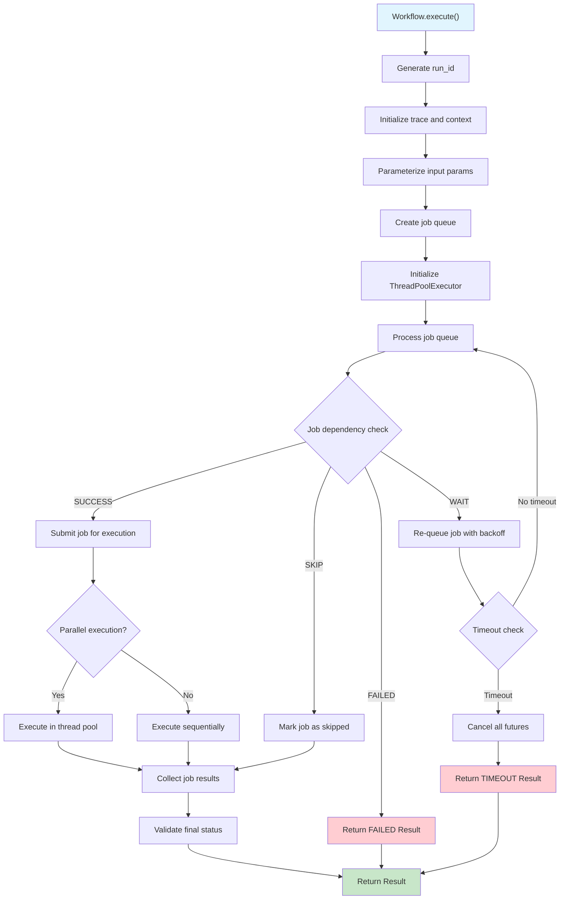
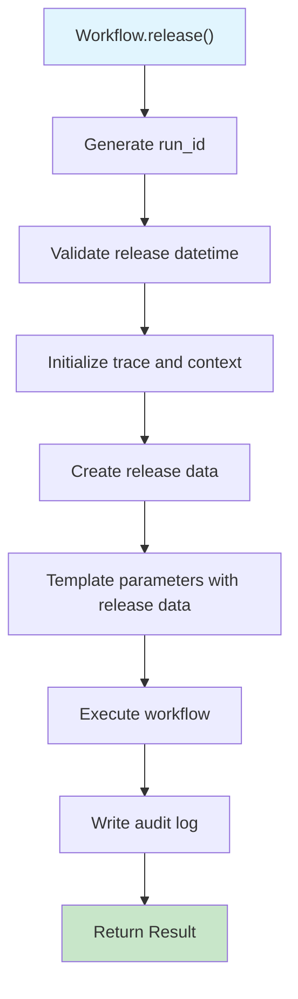

# Workflow API Reference

The Workflow module provides the core orchestration functionality for the workflow system. It manages job execution, scheduling, parameter handling, and provides comprehensive execution capabilities for complex workflows.

## Overview

The workflow system implements timeout strategy at the workflow execution layer because the main purpose is to use Workflow as an orchestrator for complex job execution scenarios. The system supports both immediate execution and scheduled execution via cron-like expressions.

## Workflow Execution Flow



## Workflow Release Flow



## Quick Start

```python
from ddeutil.workflow import Workflow
from datetime import datetime

# Load workflow from configuration
workflow = Workflow.from_conf('data-pipeline')

# Execute immediately
result = workflow.execute({
    'input_path': '/data/input',
    'output_path': '/data/output',
    'processing_date': '2024-01-01'
})

# Schedule for later execution
release_time = datetime(2024, 1, 1, 9, 0, 0)
result = workflow.release(
    release=release_time,
    params={'mode': 'batch'}
)

print(f"Workflow status: {result.status}")
```

## Classes

### Workflow

Main workflow orchestration model for job and schedule management.

The Workflow class is the core component of the workflow orchestration system. It manages job execution, scheduling via cron expressions, parameter handling, and provides comprehensive execution capabilities for complex workflows.

#### Attributes

| Attribute | Type | Default | Description |
|-----------|------|---------|-------------|
| `extras` | `dict` | `{}` | Extra parameters for overriding configuration values |
| `name` | `str` | - | Unique workflow identifier |
| `desc` | `str \| None` | `None` | Workflow description supporting markdown content |
| `params` | `dict[str, Param]` | `{}` | Parameter definitions for the workflow |
| `on` | `Event` | `Event()` | Event definitions for the workflow |
| `jobs` | `dict[str, Job]` | `{}` | Collection of jobs within this workflow |
| `tags` | `list[str]` | `[]` | List of tags for grouping workflows |
| `created_at` | `datetime` | `get_dt_now()` | Workflow creation timestamp |
| `updated_dt` | `datetime` | `get_dt_now()` | Workflow last update timestamp |

#### Methods

##### `from_conf(name, *, path=None, extras=None)`

Create Workflow instance from configuration file.

**Parameters:**
- `name` (str): Workflow name to load from configuration
- `path` (Path, optional): Optional custom configuration path to search
- `extras` (dict, optional): Additional parameters to override configuration values

**Returns:**
- `Workflow`: Validated Workflow instance loaded from configuration

**Raises:**
- `ValueError`: If workflow type doesn't match or configuration invalid
- `FileNotFoundError`: If workflow configuration file not found

##### `execute(params, *, run_id=None, parent_run_id=None, event=None, timeout=3600, max_job_parallel=2)`

Execute the workflow with provided parameters.

**Parameters:**
- `params` (dict): Parameter values for workflow execution
- `run_id` (str, optional): Unique identifier for this execution run
- `parent_run_id` (str, optional): Parent workflow run identifier
- `event` (Event, optional): Threading event for cancellation control
- `timeout` (float): Maximum execution time in seconds
- `max_job_parallel` (int): Maximum number of concurrent jobs

**Returns:**
- `Result`: Execution result with status and output data

##### `release(release, params, *, release_type='normal', run_id=None, parent_run_id=None, audit=None, override_log_name=None, result=None, timeout=600, excluded=None)`

Release workflow execution at specified datetime.

**Parameters:**
- `release` (datetime): Scheduled release datetime
- `params` (dict): Parameter values for execution
- `release_type` (ReleaseType): Type of release execution
- `run_id` (str, optional): Unique run identifier
- `parent_run_id` (str, optional): Parent run identifier
- `audit` (Audit, optional): Audit logging configuration
- `override_log_name` (str, optional): Custom log name override
- `result` (Result, optional): Pre-existing result context
- `timeout` (int): Execution timeout in seconds
- `excluded` (list[str], optional): Jobs to exclude from execution

**Returns:**
- `Result`: Release execution result

##### `rerun(context, *, run_id=None, event=None, timeout=3600, max_job_parallel=2)`

Re-execute workflow with previous context data.

**Parameters:**
- `context` (dict): Previous execution context
- `run_id` (str, optional): Unique run identifier
- `event` (Event, optional): Threading event for cancellation control
- `timeout` (float): Maximum execution time in seconds
- `max_job_parallel` (int): Maximum number of concurrent jobs

**Returns:**
- `Result`: Re-execution result

##### `execute_job(job, run_id, context, *, parent_run_id=None, event=None)`

Execute a single job within the workflow.

**Parameters:**
- `job` (Job): Job instance to execute
- `run_id` (str): Execution run identifier
- `context` (dict): Execution context
- `parent_run_id` (str, optional): Parent run identifier
- `event` (Event, optional): Threading event for cancellation control

**Returns:**
- `tuple[Status, DictData]`: Job execution status and context

##### `job(name)`

Get a job by name or ID.

**Parameters:**
- `name` (str): Job name or ID

**Returns:**
- `Job`: Job instance

**Raises:**
- `ValueError`: If job not found

##### `parameterize(params)`

Prepare and validate parameters for execution.

**Parameters:**
- `params` (dict): Input parameters

**Returns:**
- `dict`: Validated and prepared parameters

**Raises:**
- `WorkflowError`: If required parameters are missing

##### `validate_release(dt)`

Validate release datetime against workflow schedule.

**Parameters:**
- `dt` (datetime): Release datetime to validate

**Returns:**
- `datetime`: Validated release datetime

**Raises:**
- `WorkflowError`: If release datetime not supported

### ReleaseType

Release type enumeration for workflow execution modes.

#### Values

- `NORMAL`: Standard workflow release execution
- `RERUN`: Re-execution of previously failed workflow
- `EVENT`: Event-triggered workflow execution
- `FORCE`: Forced execution bypassing normal conditions

## Usage Examples

### Basic Workflow Creation and Execution

```python
from ddeutil.workflow import Workflow

# Load workflow from configuration
workflow = Workflow.from_conf('data-pipeline')

# Execute with parameters
result = workflow.execute({
    'input_path': '/data/input',
    'output_path': '/data/output',
    'processing_date': '2024-01-01'
})

if result.status == 'SUCCESS':
    print("Workflow completed successfully")
    print(f"Output: {result.context.get('outputs', {})}")
else:
    print(f"Workflow failed: {result.errors}")
```

### Workflow with Custom Configuration

```python
from pathlib import Path
from ddeutil.workflow import Workflow

# Load with custom path and extras
workflow = Workflow.from_conf(
    'data-pipeline',
    path=Path('./custom-configs'),
    extras={'environment': 'production'}
)

# Execute with timeout and job parallelism control
result = workflow.execute(
    params={'batch_size': 1000},
    timeout=1800,  # 30 minutes
    max_job_parallel=4
)
```

### Scheduled Workflow Execution

```python
from datetime import datetime
from ddeutil.workflow import Workflow, NORMAL

workflow = Workflow.from_conf('scheduled-pipeline')

# Schedule for specific time
release_time = datetime(2024, 1, 1, 9, 0, 0)
result = workflow.release(
    release=release_time,
    params={'mode': 'batch'},
    release_type=NORMAL,
    timeout=3600
)
```

### Workflow Re-execution

```python
from ddeutil.workflow import Workflow

workflow = Workflow.from_conf('failed-pipeline')

# Re-execute failed workflow
previous_context = {
    'params': {'input_file': '/data/input.csv'},
    'jobs': {
        'setup': {'status': 'SUCCESS'},
        'process': {'status': 'FAILED', 'errors': {...}}
    }
}

result = workflow.rerun(
    context=previous_context,
    timeout=1800
)
```

### Error Handling

```python
from ddeutil.workflow import Workflow, WorkflowError

try:
    workflow = Workflow.from_conf('my-workflow')
    result = workflow.execute({'param1': 'value1'})

    if result.status == 'FAILED':
        for error in result.errors:
            print(f"Error in {error.name}: {error.message}")

except WorkflowError as e:
    print(f"Workflow execution error: {e}")
except FileNotFoundError:
    print("Workflow configuration file not found")
```

### Advanced Workflow Patterns

#### Conditional Execution

```python
from ddeutil.workflow import Workflow

workflow = Workflow.from_conf('conditional-pipeline')

# Execute based on conditions
if workflow.params.get('environment') == 'production':
    result = workflow.execute({
        'mode': 'production',
        'backup_enabled': True
    })
else:
    result = workflow.execute({
        'mode': 'development',
        'backup_enabled': False
    })
```

#### Workflow Chaining

```python
from ddeutil.workflow import Workflow

# Execute workflows in sequence
workflows = ['setup', 'process', 'cleanup']

for wf_name in workflows:
    workflow = Workflow.from_conf(wf_name)
    result = workflow.execute({'step': wf_name})

    if result.status != 'SUCCESS':
        print(f"Workflow {wf_name} failed, stopping chain")
        break
```

#### Parallel Workflow Execution

```python
import asyncio
from ddeutil.workflow import Workflow

async def execute_workflow(name, params):
    workflow = Workflow.from_conf(name)
    return workflow.execute(params)

# Execute multiple workflows in parallel
async def run_parallel_workflows():
    tasks = [
        execute_workflow('workflow-a', {'param': 'value1'}),
        execute_workflow('workflow-b', {'param': 'value2'}),
        execute_workflow('workflow-c', {'param': 'value3'})
    ]

    results = await asyncio.gather(*tasks, return_exceptions=True)
    return results

# Run parallel workflows
results = asyncio.run(run_parallel_workflows())
```

## YAML Configuration

### Basic Workflow Configuration

```yaml
my-workflow:
  type: Workflow
  desc: |
    Sample data processing workflow
    with multiple stages

  params:
    input_file:
      type: str
      description: Input file path
    environment:
      type: str
      default: development

  on:
    - cron: "0 9 * * 1-5"  # Weekdays at 9 AM
      timezone: "UTC"

  jobs:
    data-ingestion:
      runs-on:
        type: local
      stages:
        - name: "Download data"
          bash: |
            wget ${{ params.data_url }} -O /tmp/data.csv

        - name: "Validate data"
          run: |
            import pandas as pd
            df = pd.read_csv('/tmp/data.csv')
            assert len(df) > 0, "Data file is empty"

    data-processing:
      needs: [data-ingestion]
      strategy:
        matrix:
          env: [dev, staging, prod]
        max-parallel: 2
      stages:
        - name: "Process data for ${{ matrix.env }}"
          run: |
            process_data(env='${{ matrix.env }}')
```

### Advanced Configuration with Dependencies

```yaml
complex-workflow:
  type: Workflow

  params:
    start_date: datetime
    end_date: datetime
    batch_size:
      type: int
      default: 1000

  jobs:
    setup:
      stages:
        - name: "Initialize workspace"
          bash: mkdir -p /tmp/workflow-data

    parallel-processing:
      needs: [setup]
      strategy:
        matrix:
          region: [us-east, us-west, eu-central]
          shard: [1, 2, 3, 4]
        max-parallel: 4
        fail-fast: false
      stages:
        - name: "Process ${{ matrix.region }}-${{ matrix.shard }}"
          bash: |
            process_region.sh \
              --region=${{ matrix.region }} \
              --shard=${{ matrix.shard }} \
              --start-date=${{ params.start_date }} \
              --end-date=${{ params.end_date }}

    aggregation:
      needs: [parallel-processing]
      stages:
        - name: "Aggregate results"
          run: |
            aggregate_results()
```

### Workflow with Error Handling

```yaml
robust-workflow:
  type: Workflow

  params:
    retry_count:
      type: int
      default: 3

  jobs:
    main-process:
      stages:
        - name: "Attempt processing"
          retry: ${{ params.retry_count }}
          run: |
            process_data()

    fallback:
      needs: [main-process]
      if: "${{ needs.main-process.result == 'failure' }}"
      stages:
        - name: "Fallback processing"
          run: |
            fallback_process()

    cleanup:
      needs: [main-process, fallback]
      if: "${{ always() }}"
      stages:
        - name: "Cleanup resources"
          run: |
            cleanup_resources()
```

### Scheduled Workflow with Multiple Triggers

```yaml
scheduled-workflow:
  type: Workflow

  on:
    # Daily at 2 AM UTC
    - cron: "0 2 * * *"
      timezone: "UTC"

    # Every Monday at 9 AM local time
    - cron: "0 9 * * 1"
      timezone: "America/New_York"

    # Manual trigger
    - manual: true

  jobs:
    scheduled-task:
      stages:
        - name: "Scheduled execution"
          run: |
            print(f"Executing at {datetime.now()}")
            perform_scheduled_task()
```

## Workflow Patterns

### Fan-Out/Fan-In Pattern

```yaml
fan-out-fan-in:
  type: Workflow

  jobs:
    split:
      stages:
        - name: "Split data"
          run: |
            partitions = split_data()
            result.outputs = {"partitions": partitions}

    process-partitions:
      needs: [split]
      strategy:
        matrix:
          partition: ${{ fromJson(needs.split.outputs.partitions) }}
        max-parallel: 5
      stages:
        - name: "Process partition ${{ matrix.partition }}"
          run: |
            process_partition(${{ matrix.partition }})

    merge:
      needs: [process-partitions]
      stages:
        - name: "Merge results"
          run: |
            merge_results()
```

### Circuit Breaker Pattern

```yaml
circuit-breaker:
  type: Workflow

  jobs:
    check-health:
      stages:
        - name: "Check system health"
          run: |
            health = check_system_health()
            if not health.is_healthy:
                raise Exception("System unhealthy")

    main-process:
      needs: [check-health]
      stages:
        - name: "Main processing"
          run: |
            process_data()

    fallback:
      needs: [check-health]
      if: "${{ needs.check-health.result == 'failure' }}"
      stages:
        - name: "Fallback mode"
          run: |
            fallback_processing()
```

### Retry with Exponential Backoff

```yaml
retry-pattern:
  type: Workflow

  jobs:
    retry-job:
      stages:
        - name: "Retry with backoff"
          retry: 5
          run: |
            import time
            attempt = context.get('attempt', 1)
            delay = 2 ** (attempt - 1)  # Exponential backoff
            time.sleep(delay)

            # Attempt the operation
            result = risky_operation()
```

## Configuration Management

### Environment-Specific Configuration

```python
from ddeutil.workflow import Workflow
from pathlib import Path

# Load environment-specific configuration
env = os.getenv('ENVIRONMENT', 'development')
config_path = Path(f'./configs/{env}')

workflow = Workflow.from_conf(
    'data-pipeline',
    path=config_path,
    extras={
        'environment': env,
        'debug_mode': env == 'development'
    }
)
```

### Dynamic Parameter Resolution

```python
from ddeutil.workflow import Workflow
from datetime import datetime, timedelta

# Calculate dynamic parameters
today = datetime.now()
yesterday = today - timedelta(days=1)

workflow = Workflow.from_conf('daily-process')

result = workflow.execute({
    'processing_date': yesterday.strftime('%Y-%m-%d'),
    'output_date': today.strftime('%Y-%m-%d'),
    'batch_size': 1000 if today.weekday() < 5 else 500  # Smaller batches on weekends
})
```

## Monitoring and Observability

### Workflow Metrics

```python
from ddeutil.workflow import Workflow
import time

workflow = Workflow.from_conf('monitored-workflow')

# Track execution metrics
start_time = time.time()
result = workflow.execute({'param': 'value'})
execution_time = time.time() - start_time

# Log metrics
print(f"Workflow execution time: {execution_time:.2f} seconds")
print(f"Workflow status: {result.status}")
print(f"Jobs executed: {len(result.context.get('jobs', {}))}")
```

### Audit Trail

```python
from ddeutil.workflow import Workflow, FileAudit
from datetime import datetime

workflow = Workflow.from_conf('audited-workflow')

# Execute with audit logging
result = workflow.release(
    release=datetime.now(),
    params={'mode': 'production'},
    audit=FileAudit,
    timeout=3600
)

# Audit log contains:
# - Execution metadata
# - Input parameters
# - Job execution results
# - Timing information
# - Error details (if any)
```

## Best Practices

### 1. Workflow Design

- **Modularity**: Break complex workflows into smaller, focused jobs
- **Reusability**: Design workflows to be reusable across different contexts
- **Idempotency**: Ensure workflows can be safely re-executed
- **Error handling**: Implement proper error handling and recovery mechanisms

### 2. Parameter Management

- **Validation**: Use parameter types and constraints for validation
- **Defaults**: Provide sensible default values for optional parameters
- **Documentation**: Document all parameters with clear descriptions
- **Sensitivity**: Handle sensitive parameters securely

### 3. Scheduling

- **Timezone awareness**: Always specify timezones for scheduled executions
- **Conflict avoidance**: Avoid scheduling conflicts between related workflows
- **Resource consideration**: Consider system resources when scheduling
- **Monitoring**: Monitor scheduled execution success rates

### 4. Performance

- **Parallelization**: Use matrix strategies for parallel job execution
- **Resource limits**: Set appropriate timeouts and resource limits
- **Caching**: Cache expensive operations when possible
- **Optimization**: Profile and optimize slow workflows

### 5. Security

- **Access control**: Implement proper access controls for workflows
- **Secret management**: Use secure methods for handling secrets
- **Input validation**: Validate all inputs to prevent injection attacks
- **Audit logging**: Enable audit logging for compliance

### 6. Testing

- **Unit testing**: Test individual workflow components
- **Integration testing**: Test workflow interactions
- **Error scenarios**: Test failure modes and recovery
- **Performance testing**: Validate workflow performance under load

## Troubleshooting

### Common Issues

#### Workflow Not Found

```python
# Problem: Workflow configuration file not found
try:
    workflow = Workflow.from_conf('missing-workflow')
except FileNotFoundError:
    print("Check configuration path and workflow name")
    print("Available workflows:", list_available_workflows())
```

#### Parameter Validation Errors

```python
# Problem: Invalid parameter values
try:
    result = workflow.execute({'invalid_param': 'value'})
except ParamError as e:
    print(f"Parameter error: {e.param_name}")
    print(f"Validation error: {e.validation_error}")
    print("Valid parameters:", workflow.params.keys())
```

#### Timeout Issues

```python
# Problem: Workflow execution timeout
try:
    result = workflow.execute(params, timeout=300)  # 5 minutes
except WorkflowTimeoutError:
    print("Workflow timed out - consider:")
    print("1. Increasing timeout value")
    print("2. Optimizing workflow performance")
    print("3. Breaking into smaller workflows")
```

#### Job Dependency Issues

```python
# Problem: Job dependency failures
result = workflow.execute(params)

if result.status == 'FAILED':
    failed_jobs = [
        job_id for job_id, job_result in result.context.get('jobs', {}).items()
        if job_result.get('status') == 'FAILED'
    ]
    print(f"Failed jobs: {failed_jobs}")

    # Check dependency chain
    for job_id in failed_jobs:
        job = workflow.jobs.get(job_id)
        if job:
            print(f"Job {job_id} depends on: {job.needs}")
```

### Debugging Tips

1. **Enable debug logging**: Set log level to DEBUG for detailed execution information
2. **Use trace logs**: Check trace logs for detailed execution flow
3. **Validate configuration**: Use configuration validation tools
4. **Test incrementally**: Test individual jobs before running full workflow
5. **Monitor resources**: Check system resources during execution

## Configuration Reference

### Environment Variables

| Variable | Default | Description |
|----------|---------|-------------|
| `WORKFLOW_CORE_CONF_PATH` | `./conf` | Configuration file path |
| `WORKFLOW_CORE_TIMEOUT` | `3600` | Default workflow timeout |
| `WORKFLOW_CORE_MAX_JOB_PARALLEL` | `2` | Default max parallel jobs |
| `WORKFLOW_CORE_AUDIT_ENABLED` | `true` | Enable audit logging |

### File Structure

```
conf/
├── workflows/
│   ├── data-pipeline.yml
│   ├── etl-process.yml
│   └── deployment.yml
├── jobs/
│   ├── common.yml
│   └── templates.yml
└── stages/
    ├── validation.yml
    └── processing.yml
```
