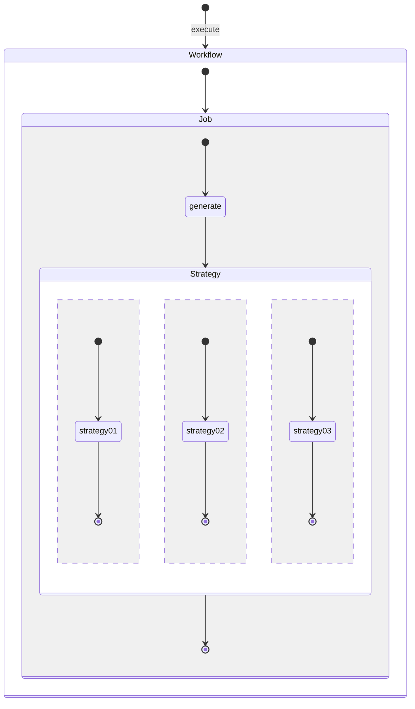
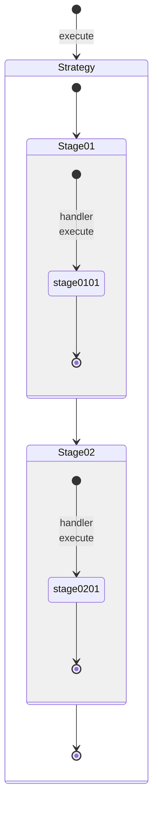

# Context

## Workflow Execute

A workflow execution context that return from the `execute` method.

## Job Execute

A job execution context that return from the `execute` method.

## Stage Execute

A stage execution context that return from the `handler_execute` method.
