# Event Trigger Examples for Data Pipeline Workflows

This document provides comprehensive examples of how to use the various event trigger types in real-world data pipeline scenarios.

## Overview

The workflow system supports multiple types of event triggers that are initiated by external services and systems:

- **Cron Scheduling**: Time-based triggers (existing)
- **Release Events**: Workflow-to-workflow triggers (existing)
- **File Events**: File system event triggers from external services (new)
- **Webhook Events**: API/webhook-based triggers from external systems (new)
- **Database Events**: Database change event triggers from external services (new)
- **Sensor Events**: Sensor-based event triggers from monitoring systems (new)
- **Polling Events**: Polling-based triggers for systems without event capabilities (new)
- **Message Queue Events**: Message queue-based triggers (new)
- **Stream Processing Events**: Real-time stream processing triggers (new)
- **Batch Processing Events**: Batch job completion triggers (new)

## Event Trigger Flow Architecture

All event triggers follow this flow:

```
External Service/System → Event Trigger → Workflow Execution
```

The workflow system primarily relies on external services to detect events and trigger workflows through webhook mechanisms. However, polling events are also supported for systems without event capabilities or as fallback mechanisms.

### Overview Flowchart

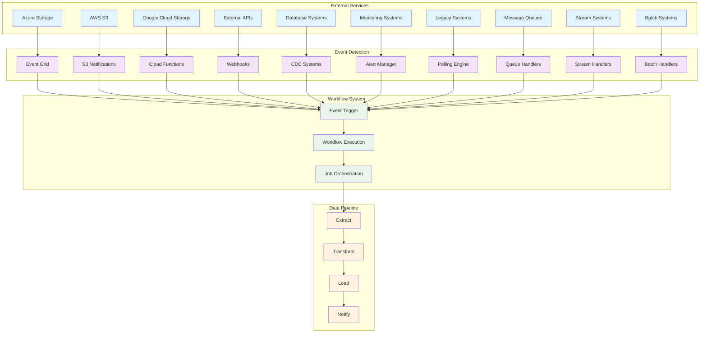

## Advanced Event Trigger Patterns

### 1. Event-Driven Data Pipeline Patterns

#### Pattern 1: Multi-Stage ETL with Event Chaining

```yaml
event-driven-etl-pipeline:
  type: Workflow
  params:
    data_source: str
    processing_stage: str
    batch_id: str

  on:
    # Initial trigger from file arrival
    file:
      - path: "/data/raw"
        pattern: "*.csv"
        event_type: "created"
        source: "azure-storage"
        debounce_seconds: 30

    # Secondary trigger from upstream processing
    release:
      - "data-validation-workflow"
      - "data-enrichment-workflow"

    # Monitoring trigger for pipeline health
    sensor:
      - sensor_type: "pipeline_health"
        threshold: 95.0
        operator: "lt"
        source: "datadog-monitoring"
        check_interval_seconds: 0
        window_size: 300

  jobs:
    validate-trigger-source:
      stages:
        - name: "Determine Trigger Source"
          run: |
            source = params.get('trigger_source', 'unknown')
            stage = params.get('processing_stage', 'unknown')

            if source == 'file_event':
                result.outputs = {"next_stage": "extract"}
            elif source == 'release_event':
                result.outputs = {"next_stage": "transform"}
            elif source == 'sensor_event':
                result.outputs = {"next_stage": "monitor"}
            else:
                result.outputs = {"next_stage": "unknown"}

    extract-data:
      needs: ["validate-trigger-source"]
      if: "${{ stages.validate-trigger-source.outputs.next_stage == 'extract' }}"
      stages:
        - name: "Extract Raw Data"
          uses: "extractors/azure_storage@latest"
          with:
            container: "raw-data"
            file_pattern: "*.csv"

        - name: "Validate Schema"
          uses: "validation/schema_check@latest"
          with:
            schema_file: "schemas/raw_data.json"

        - name: "Trigger Validation Workflow"
          trigger: "data-validation-workflow"
          params:
            batch_id: "${{ params.batch_id }}"
            data_path: "${{ stages.extract-raw-data.outputs.data_path }}"

    transform-data:
      needs: ["validate-trigger-source"]
      if: "${{ stages.validate-trigger-source.outputs.next_stage == 'transform' }}"
      stages:
        - name: "Transform Data"
          uses: "transformers/data_processor@latest"
          with:
            input_path: "${{ params.data_path }}"
            transformation_rules: "rules/transform.json"

        - name: "Quality Check"
          uses: "quality/data_quality@latest"
          with:
            data_path: "${{ stages.transform-data.outputs.output_path }}"

        - name: "Trigger Enrichment Workflow"
          trigger: "data-enrichment-workflow"
          params:
            batch_id: "${{ params.batch_id }}"
            processed_data: "${{ stages.transform-data.outputs.output_path }}"

    monitor-pipeline:
      needs: ["validate-trigger-source"]
      if: "${{ stages.validate-trigger-source.outputs.next_stage == 'monitor' }}"
      stages:
        - name: "Analyze Pipeline Health"
          uses: "monitoring/pipeline_analyzer@latest"
          with:
            metrics: "${{ params.metric_data }}"

        - name: "Send Alert"
          uses: "notifications/send_alert@latest"
          with:
            level: "warning"
            message: "Pipeline health below threshold"
            details: "${{ stages.analyze-pipeline-health.outputs.analysis }}"
```

#### Pattern 2: Real-Time Stream Processing

```yaml
real-time-stream-pipeline:
  type: Workflow
  params:
    stream_data: dict
    processing_window: int
    aggregation_type: str

  on:
    # Kafka stream events
    webhook:
      - endpoint: "/webhook/kafka-stream"
        method: "POST"
        headers:
          "X-Kafka-Topic": "${{ env.KAFKA_TOPIC }}"
        timeout_seconds: 15

    # Time-based window processing
    schedule:
      - cron: "*/5 * * * *"  # Every 5 minutes
        timezone: "UTC"

    # Stream health monitoring
    sensor:
      - sensor_type: "stream_lag"
        threshold: 300  # 5 minutes
        operator: "gt"
        source: "kafka-monitoring"
        check_interval_seconds: 0
        window_size: 60

  jobs:
    process-stream-window:
      stages:
        - name: "Collect Stream Data"
          uses: "streaming/collect_window@latest"
          with:
            window_size: "${{ params.processing_window }}"
            aggregation_type: "${{ params.aggregation_type }}"

        - name: "Process Stream Events"
          uses: "streaming/process_events@latest"
          with:
            events: "${{ stages.collect-stream-window.outputs.events }}"

        - name: "Update Real-Time Dashboard"
          uses: "streaming/update_dashboard@latest"
          with:
            processed_data: "${{ stages.process-stream-events.outputs.results }}"

        - name: "Store to Time-Series DB"
          uses: "storage/timeseries_store@latest"
          with:
            data: "${{ stages.process-stream-events.outputs.results }}"
            database: "influxdb"
```

#### Pattern 3: Batch Processing with Event Coordination

```yaml
batch-processing-pipeline:
  type: Workflow
  params:
    batch_size: int
    processing_date: date
    data_sources: list

  on:
    # Batch job completion events
    webhook:
      - endpoint: "/webhook/batch-complete"
        method: "POST"
        headers:
          "X-Batch-ID": "${{ env.BATCH_ID }}"
        timeout_seconds: 30

    # Daily batch schedule
    schedule:
      - cron: "0 2 * * *"  # Daily at 2 AM
        timezone: "UTC"

    # Batch processing monitoring
    sensor:
      - sensor_type: "batch_duration"
        threshold: 3600  # 1 hour
        operator: "gt"
        source: "batch-monitoring"
        check_interval_seconds: 0
        window_size: 300

  jobs:
    coordinate-batch:
      stages:
        - name: "Check Batch Prerequisites"
          uses: "batch/check_prerequisites@latest"
          with:
            date: "${{ params.processing_date }}"
            sources: "${{ params.data_sources }}"

        - name: "Start Parallel Processing"
          uses: "batch/start_parallel_jobs@latest"
          with:
            batch_size: "${{ params.batch_size }}"
            sources: "${{ stages.check-batch-prerequisites.outputs.ready_sources }}"

        - name: "Monitor Batch Progress"
          uses: "batch/monitor_progress@latest"
          with:
            batch_id: "${{ stages.start-parallel-jobs.outputs.batch_id }}"

        - name: "Consolidate Results"
          uses: "batch/consolidate_results@latest"
          with:
            batch_id: "${{ stages.start-parallel-jobs.outputs.batch_id }}"

        - name: "Trigger Downstream Workflows"
          trigger: "data-warehouse-load"
          params:
            consolidated_data: "${{ stages.consolidate-results.outputs.data_path }}"
            batch_id: "${{ stages.start-parallel-jobs.outputs.batch_id }}"
```

### 2. Advanced File Processing Patterns

#### Pattern 4: Multi-Format File Processing

```yaml
multi-format-file-pipeline:
  type: Workflow
  params:
    file_path: str
    file_format: str
    processing_rules: dict

  on:
    file:
      # CSV files
      - path: "/data/csv"
        pattern: "*.csv"
        event_type: "created"
        source: "azure-storage"
        debounce_seconds: 30

      # JSON files
      - path: "/data/json"
        pattern: "*.json"
        event_type: "created"
        source: "aws-s3"
        debounce_seconds: 45

      # Parquet files
      - path: "/data/parquet"
        pattern: "*.parquet"
        event_type: "created"
        source: "google-cloud-storage"
        debounce_seconds: 60

      # Excel files
      - path: "/data/excel"
        pattern: "*.xlsx"
        event_type: "created"
        source: "azure-storage"
        debounce_seconds: 30

  jobs:
    detect-file-format:
      stages:
        - name: "Analyze File Format"
          run: |
            file_path = params.get('file_path', '')
            file_extension = file_path.split('.')[-1].lower()

            format_handlers = {
                'csv': 'csv-processor',
                'json': 'json-processor',
                'parquet': 'parquet-processor',
                'xlsx': 'excel-processor'
            }

            processor = format_handlers.get(file_extension, 'generic-processor')
            result.outputs = {"processor": processor, "format": file_extension}

    process-csv:
      needs: ["detect-file-format"]
      if: "${{ stages.analyze-file-format.outputs.format == 'csv' }}"
      stages:
        - name: "Process CSV File"
          uses: "processors/csv_processor@latest"
          with:
            file_path: "${{ params.file_path }}"
            delimiter: ","
            encoding: "utf-8"

        - name: "Validate CSV Data"
          uses: "validation/csv_validator@latest"
          with:
            data: "${{ stages.process-csv-file.outputs.data }}"
            schema: "schemas/csv_schema.json"

    process-json:
      needs: ["detect-file-format"]
      if: "${{ stages.analyze-file-format.outputs.format == 'json' }}"
      stages:
        - name: "Process JSON File"
          uses: "processors/json_processor@latest"
          with:
            file_path: "${{ params.file_path }}"
            json_path: "${{ params.processing_rules.json_path }}"

        - name: "Flatten JSON Structure"
          uses: "transformers/json_flattener@latest"
          with:
            json_data: "${{ stages.process-json-file.outputs.data }}"

    process-parquet:
      needs: ["detect-file-format"]
      if: "${{ stages.analyze-file-format.outputs.format == 'parquet' }}"
      stages:
        - name: "Process Parquet File"
          uses: "processors/parquet_processor@latest"
          with:
            file_path: "${{ params.file_path }}"
            columns: "${{ params.processing_rules.columns }}"

        - name: "Optimize Parquet"
          uses: "optimizers/parquet_optimizer@latest"
          with:
            data: "${{ stages.process-parquet-file.outputs.data }}"

    process-excel:
      needs: ["detect-file-format"]
      if: "${{ stages.analyze-file-format.outputs.format == 'xlsx' }}"
      stages:
        - name: "Process Excel File"
          uses: "processors/excel_processor@latest"
          with:
            file_path: "${{ params.file_path }}"
            sheet_name: "${{ params.processing_rules.sheet_name }}"

        - name: "Extract Multiple Sheets"
          uses: "processors/excel_sheet_extractor@latest"
          with:
            file_path: "${{ params.file_path }}"
            sheets: "${{ params.processing_rules.sheets }}"

    consolidate-results:
      needs: ["process-csv", "process-json", "process-parquet", "process-excel"]
      trigger_rule: "any_success"
      stages:
        - name: "Consolidate All Formats"
          uses: "consolidators/multi_format@latest"
          with:
            csv_data: "${{ stages.process-csv.outputs.data }}"
            json_data: "${{ stages.process-json.outputs.data }}"
            parquet_data: "${{ stages.process-parquet.outputs.data }}"
            excel_data: "${{ stages.process-excel.outputs.data }}"

        - name: "Load to Data Warehouse"
          uses: "loaders/warehouse_loader@latest"
          with:
            consolidated_data: "${{ stages.consolidate-all-formats.outputs.data }}"
```

#### Pattern 5: File Processing with Quality Gates

```yaml
quality-gated-file-pipeline:
  type: Workflow
  params:
    file_path: str
    quality_threshold: float
    processing_mode: str

  on:
    file:
      - path: "/data/quality-checked"
        pattern: "*.csv"
        event_type: "created"
        source: "azure-storage"
        debounce_seconds: 30

  jobs:
    quality-assessment:
      stages:
        - name: "Assess Data Quality"
          uses: "quality/data_assessor@latest"
          with:
            file_path: "${{ params.file_path }}"
            quality_metrics: ["completeness", "accuracy", "consistency", "timeliness"]

        - name: "Calculate Quality Score"
          run: |
            metrics = stages['assess-data-quality'].outputs.get('metrics', {})

            completeness = metrics.get('completeness', 0)
            accuracy = metrics.get('accuracy', 0)
            consistency = metrics.get('consistency', 0)
            timeliness = metrics.get('timeliness', 0)

            quality_score = (completeness + accuracy + consistency + timeliness) / 4
            result.outputs = {"quality_score": quality_score}

        - name: "Quality Gate Decision"
          run: |
            quality_score = stages['calculate-quality-score'].outputs.get('quality_score', 0)
            threshold = params.get('quality_threshold', 0.8)

            if quality_score >= threshold:
                result.outputs = {"proceed": True, "reason": "Quality threshold met"}
            else:
                result.outputs = {"proceed": False, "reason": f"Quality score {quality_score} below threshold {threshold}"}

    process-high-quality:
      needs: ["quality-assessment"]
      if: "${{ stages.quality-gate-decision.outputs.proceed }}"
      stages:
        - name: "Process High-Quality Data"
          uses: "processors/high_quality_processor@latest"
          with:
            file_path: "${{ params.file_path }}"
            quality_score: "${{ stages.calculate-quality-score.outputs.quality_score }}"

        - name: "Load to Production"
          uses: "loaders/production_loader@latest"
          with:
            processed_data: "${{ stages.process-high-quality-data.outputs.data }}"

    handle-low-quality:
      needs: ["quality-assessment"]
      if: "${{ not stages.quality-gate-decision.outputs.proceed }}"
      stages:
        - name: "Log Quality Issues"
          uses: "logging/quality_logger@latest"
          with:
            file_path: "${{ params.file_path }}"
            quality_score: "${{ stages.calculate-quality-score.outputs.quality_score }}"
            reason: "${{ stages.quality-gate-decision.outputs.reason }}"

        - name: "Send Quality Alert"
          uses: "notifications/quality_alert@latest"
          with:
            level: "warning"
            message: "Data quality below threshold"
            details: "${{ stages.log-quality-issues.outputs.log_entry }}"

        - name: "Move to Quarantine"
          uses: "storage/move_to_quarantine@latest"
          with:
            file_path: "${{ params.file_path }}"
            quarantine_reason: "${{ stages.quality-gate-decision.outputs.reason }}"
```

### 3. Advanced Database Integration Patterns

#### Pattern 6: Multi-Database CDC Pipeline

```yaml
multi-database-cdc-pipeline:
  type: Workflow
  params:
    source_database: str
    change_data: dict
    operation_type: str
    table_name: str

  on:
    database:
      # Primary database CDC
      - connection_string: "${{ env.PRIMARY_DB_URL }}"
        table: "orders"
        operation: "any"
        source: "debezium-cdc"
        check_interval_seconds: 0

      # Secondary database CDC
      - connection_string: "${{ env.SECONDARY_DB_URL }}"
        table: "inventory"
        operation: "any"
        source: "debezium-cdc"
        check_interval_seconds: 0

      # Audit database changes
      - connection_string: "${{ env.AUDIT_DB_URL }}"
        table: "audit_logs"
        operation: "insert"
        source: "debezium-cdc"
        check_interval_seconds: 0

  jobs:
    route-database-changes:
      stages:
        - name: "Route by Database Source"
          run: |
            source_db = params.get('source_database', 'unknown')
            table = params.get('table_name', 'unknown')
            operation = params.get('operation_type', 'unknown')

            routing_rules = {
                'primary_db': {
                    'orders': 'order-processor',
                    'customers': 'customer-processor'
                },
                'secondary_db': {
                    'inventory': 'inventory-processor',
                    'products': 'product-processor'
                },
                'audit_db': {
                    'audit_logs': 'audit-processor'
                }
            }

            processor = routing_rules.get(source_db, {}).get(table, 'generic-processor')
            result.outputs = {"processor": processor, "source": source_db}

    process-order-changes:
      needs: ["route-database-changes"]
      if: "${{ stages.route-database-changes.outputs.processor == 'order-processor' }}"
      stages:
        - name: "Process Order Changes"
          uses: "processors/order_processor@latest"
          with:
            change_data: "${{ params.change_data }}"
            operation: "${{ params.operation_type }}"

        - name: "Update Order Analytics"
          uses: "analytics/order_analytics@latest"
          with:
            processed_changes: "${{ stages.process-order-changes.outputs.processed_data }}"

        - name: "Sync to Data Warehouse"
          uses: "warehouse/sync_orders@latest"
          with:
            analytics_data: "${{ stages.update-order-analytics.outputs.analytics }}"

    process-inventory-changes:
      needs: ["route-database-changes"]
      if: "${{ stages.route-database-changes.outputs.processor == 'inventory-processor' }}"
      stages:
        - name: "Process Inventory Changes"
          uses: "processors/inventory_processor@latest"
          with:
            change_data: "${{ params.change_data }}"
            operation: "${{ params.operation_type }}"

        - name: "Update Inventory Levels"
          uses: "inventory/update_levels@latest"
          with:
            processed_changes: "${{ stages.process-inventory-changes.outputs.processed_data }}"

        - name: "Check Reorder Points"
          uses: "inventory/check_reorder@latest"
          with:
            inventory_levels: "${{ stages.update-inventory-levels.outputs.levels }}"

    process-audit-changes:
      needs: ["route-database-changes"]
      if: "${{ stages.route-database-changes.outputs.processor == 'audit-processor' }}"
      stages:
        - name: "Process Audit Changes"
          uses: "processors/audit_processor@latest"
          with:
            change_data: "${{ params.change_data }}"
            operation: "${{ params.operation_type }}"

        - name: "Compliance Check"
          uses: "compliance/audit_check@latest"
          with:
            audit_data: "${{ stages.process-audit-changes.outputs.processed_data }}"

        - name: "Generate Compliance Report"
          uses: "reports/compliance_report@latest"
          with:
            compliance_results: "${{ stages.compliance-check.outputs.results }}"
```

#### Pattern 7: Database Migration with Event Tracking

```yaml
database-migration-pipeline:
  type: Workflow
  params:
    migration_id: str
    source_schema: str
    target_schema: str
    migration_type: str

  on:
    database:
      # Migration completion events
      - connection_string: "${{ env.MIGRATION_DB_URL }}"
        table: "migration_logs"
        operation: "insert"
        source: "migration-tracker"
        check_interval_seconds: 0

      # Data validation events
      - connection_string: "${{ env.VALIDATION_DB_URL }}"
        table: "validation_results"
        operation: "insert"
        source: "validation-tracker"
        check_interval_seconds: 0

    # Migration schedule
    schedule:
      - cron: "0 1 * * *"  # Daily at 1 AM
        timezone: "UTC"

  jobs:
    track-migration-progress:
      stages:
        - name: "Monitor Migration Status"
          uses: "migration/monitor_status@latest"
          with:
            migration_id: "${{ params.migration_id }}"

        - name: "Check Migration Completion"
          run: |
            status = stages['monitor-migration-status'].outputs.get('status', 'unknown')

            if status == 'completed':
                result.outputs = {"next_action": "validate"}
            elif status == 'failed':
                result.outputs = {"next_action": "rollback"}
            else:
                result.outputs = {"next_action": "wait"}

    validate-migration:
      needs: ["track-migration-progress"]
      if: "${{ stages.track-migration-progress.outputs.next_action == 'validate' }}"
      stages:
        - name: "Run Data Validation"
          uses: "validation/migration_validator@latest"
          with:
            source_schema: "${{ params.source_schema }}"
            target_schema: "${{ params.target_schema }}"
            migration_id: "${{ params.migration_id }}"

        - name: "Compare Data Integrity"
          uses: "validation/data_integrity@latest"
          with:
            source_data: "${{ stages.run-data-validation.outputs.source_sample }}"
            target_data: "${{ stages.run-data-validation.outputs.target_sample }}"

        - name: "Generate Validation Report"
          uses: "reports/validation_report@latest"
          with:
            validation_results: "${{ stages.compare-data-integrity.outputs.comparison }}"

        - name: "Send Validation Notification"
          uses: "notifications/migration_notification@latest"
          with:
            migration_id: "${{ params.migration_id }}"
            validation_status: "${{ stages.compare-data-integrity.outputs.status }}"

    rollback-migration:
      needs: ["track-migration-progress"]
      if: "${{ stages.track-migration-progress.outputs.next_action == 'rollback' }}"
      stages:
        - name: "Initiate Rollback"
          uses: "migration/rollback@latest"
          with:
            migration_id: "${{ params.migration_id }}"
            source_schema: "${{ params.source_schema }}"

        - name: "Verify Rollback"
          uses: "migration/verify_rollback@latest"
          with:
            migration_id: "${{ params.migration_id }}"

        - name: "Send Rollback Alert"
          uses: "notifications/rollback_alert@latest"
          with:
            migration_id: "${{ params.migration_id }}"
            rollback_status: "${{ stages.verify-rollback.outputs.status }}"
```

### 4. Advanced Monitoring and Alerting Patterns

#### Pattern 8: Intelligent Alerting with Escalation

```yaml
intelligent-alerting-pipeline:
  type: Workflow
  params:
    alert_data: dict
    alert_severity: str
    alert_source: str
    escalation_level: int

  on:
    sensor:
      # System health monitoring
      - sensor_type: "system_health"
        threshold: 90.0
        operator: "lt"
        source: "prometheus-alertmanager"
        check_interval_seconds: 0
        window_size: 300

      # Business metrics monitoring
      - sensor_type: "business_metrics"
        threshold: 1000
        operator: "lt"
        source: "datadog-monitoring"
        check_interval_seconds: 0
        window_size: 3600

      # Performance monitoring
      - sensor_type: "performance_metrics"
        threshold: 2000
        operator: "gt"
        source: "newrelic-monitoring"
        check_interval_seconds: 0
        window_size: 600

  jobs:
    analyze-alert-context:
      stages:
        - name: "Analyze Alert Context"
          uses: "monitoring/alert_analyzer@latest"
          with:
            alert_data: "${{ params.alert_data }}"
            alert_severity: "${{ params.alert_severity }}"
            alert_source: "${{ params.alert_source }}"

        - name: "Determine Escalation Level"
          run: |
            severity = params.get('alert_severity', 'low')
            current_level = params.get('escalation_level', 0)

            severity_levels = {
                'critical': 3,
                'high': 2,
                'medium': 1,
                'low': 0
            }

            required_level = severity_levels.get(severity, 0)
            escalation_needed = required_level > current_level

            result.outputs = {
                "escalation_needed": escalation_needed,
                "required_level": required_level,
                "current_level": current_level
            }

    handle-critical-alert:
      needs: ["analyze-alert-context"]
      if: "${{ params.alert_severity == 'critical' }}"
      stages:
        - name: "Immediate Response"
          uses: "monitoring/immediate_response@latest"
          with:
            alert_data: "${{ params.alert_data }}"

        - name: "Page On-Call Team"
          uses: "notifications/page_oncall@latest"
          with:
            alert_data: "${{ params.alert_data }}"
            escalation_level: "${{ stages.analyze-alert-context.outputs.required_level }}"

        - name: "Initiate Auto-Recovery"
          uses: "recovery/auto_recovery@latest"
          with:
            alert_data: "${{ params.alert_data }}"
            recovery_actions: "${{ stages.immediate-response.outputs.recovery_plan }}"

    handle-high-alert:
      needs: ["analyze-alert-context"]
      if: "${{ params.alert_severity == 'high' }}"
      stages:
        - name: "Send High Priority Alert"
          uses: "notifications/high_priority_alert@latest"
          with:
            alert_data: "${{ params.alert_data }}"

        - name: "Schedule Investigation"
          uses: "monitoring/schedule_investigation@latest"
          with:
            alert_data: "${{ params.alert_data }}"
            priority: "high"

    handle-medium-alert:
      needs: ["analyze-alert-context"]
      if: "${{ params.alert_severity == 'medium' }}"
      stages:
        - name: "Send Medium Priority Alert"
          uses: "notifications/medium_priority_alert@latest"
          with:
            alert_data: "${{ params.alert_data }}"

        - name: "Log for Review"
          uses: "logging/alert_logger@latest"
          with:
            alert_data: "${{ params.alert_data }}"
            review_required: True

    escalate-alert:
      needs: ["analyze-alert-context"]
      if: "${{ stages.analyze-alert-context.outputs.escalation_needed }}"
      stages:
        - name: "Escalate Alert"
          uses: "escalation/escalate_alert@latest"
          with:
            alert_data: "${{ params.alert_data }}"
            current_level: "${{ stages.analyze-alert-context.outputs.current_level }}"
            required_level: "${{ stages.analyze-alert-context.outputs.required_level }}"

        - name: "Notify Management"
          uses: "notifications/management_notification@latest"
          with:
            alert_data: "${{ params.alert_data }}"
            escalation_details: "${{ stages.escalate-alert.outputs.escalation_details }}"
```

#### Pattern 9: Predictive Monitoring

```yaml
predictive-monitoring-pipeline:
  type: Workflow
  params:
    metric_data: dict
    prediction_window: int
    confidence_threshold: float

  on:
    sensor:
      # Anomaly detection
      - sensor_type: "anomaly_detection"
        threshold: 0.8
        operator: "gt"
        source: "ml-monitoring"
        check_interval_seconds: 0
        window_size: 1800

      # Trend analysis
      - sensor_type: "trend_analysis"
        threshold: 0.7
        operator: "gt"
        source: "ml-monitoring"
        check_interval_seconds: 0
        window_size: 3600

  jobs:
    analyze-predictions:
      stages:
        - name: "Analyze Metric Trends"
          uses: "ml/trend_analyzer@latest"
          with:
            metric_data: "${{ params.metric_data }}"
            prediction_window: "${{ params.prediction_window }}"

        - name: "Generate Predictions"
          uses: "ml/prediction_engine@latest"
          with:
            trend_data: "${{ stages.analyze-metric-trends.outputs.trends }}"
            confidence_threshold: "${{ params.confidence_threshold }}"

        - name: "Assess Risk Level"
          run: |
            predictions = stages['generate-predictions'].outputs.get('predictions', [])
            confidence = stages['generate-predictions'].outputs.get('confidence', 0)

            risk_levels = {
                'high': 0.9,
                'medium': 0.7,
                'low': 0.5
            }

            risk_level = 'low'
            for level, threshold in risk_levels.items():
                if confidence >= threshold:
                    risk_level = level

            result.outputs = {"risk_level": risk_level, "confidence": confidence}

    handle-high-risk:
      needs: ["analyze-predictions"]
      if: "${{ stages.assess-risk-level.outputs.risk_level == 'high' }}"
      stages:
        - name: "Send High Risk Alert"
          uses: "notifications/high_risk_alert@latest"
          with:
            predictions: "${{ stages.generate-predictions.outputs.predictions }}"
            confidence: "${{ stages.assess-risk-level.outputs.confidence }}"

        - name: "Initiate Preventive Actions"
          uses: "prevention/preventive_actions@latest"
          with:
            predictions: "${{ stages.generate-predictions.outputs.predictions }}"
            risk_level: "${{ stages.assess-risk-level.outputs.risk_level }}"

    handle-medium-risk:
      needs: ["analyze-predictions"]
      if: "${{ stages.assess-risk-level.outputs.risk_level == 'medium' }}"
      stages:
        - name: "Send Medium Risk Alert"
          uses: "notifications/medium_risk_alert@latest"
          with:
            predictions: "${{ stages.generate-predictions.outputs.predictions }}"
            confidence: "${{ stages.assess-risk-level.outputs.confidence }}"

        - name: "Schedule Monitoring"
          uses: "monitoring/schedule_monitoring@latest"
          with:
            predictions: "${{ stages.generate-predictions.outputs.predictions }}"
            monitoring_interval: "5m"

    handle-low-risk:
      needs: ["analyze-predictions"]
      if: "${{ stages.assess-risk-level.outputs.risk_level == 'low' }}"
      stages:
        - name: "Log Prediction"
          uses: "logging/prediction_logger@latest"
          with:
            predictions: "${{ stages.generate-predictions.outputs.predictions }}"
            confidence: "${{ stages.assess-risk-level.outputs.confidence }}"

        - name: "Update Prediction Model"
          uses: "ml/update_model@latest"
          with:
            prediction_data: "${{ stages.generate-predictions.outputs.predictions }}"
            actual_outcomes: "${{ params.metric_data }}"
```

## Message Queue Triggers

### RabbitMQ Message Processing

```yaml
rabbitmq-message-pipeline:
  type: Workflow
  params:
    message_data: dict
    queue_name: str
    message_id: str

  on:
    message_queue:
      - queue_name: "data-processing-queue"
        message_pattern: ".*order.*"
        source: "rabbitmq"
        batch_size: 20
        visibility_timeout: 300
        dead_letter_queue: "failed-messages"

  jobs:
    process-message:
      stages:
        - name: "Parse Message"
          uses: "queue/parse_message@latest"
          with:
            message_data: "${{ params.message_data }}"
            queue_name: "${{ params.queue_name }}"

        - name: "Validate Message"
          uses: "validation/message_validator@latest"
          with:
            parsed_data: "${{ stages.parse-message.outputs.parsed_data }}"

        - name: "Process Order Data"
          uses: "processors/order_processor@latest"
          with:
            validated_data: "${{ stages.validate-message.outputs.validated_data }}"

        - name: "Acknowledge Message"
          uses: "queue/acknowledge_message@latest"
          with:
            message_id: "${{ params.message_id }}"
            queue_name: "${{ params.queue_name }}"
```

**Flow Trigger**: RabbitMQ → Message Queue → Webhook → Workflow

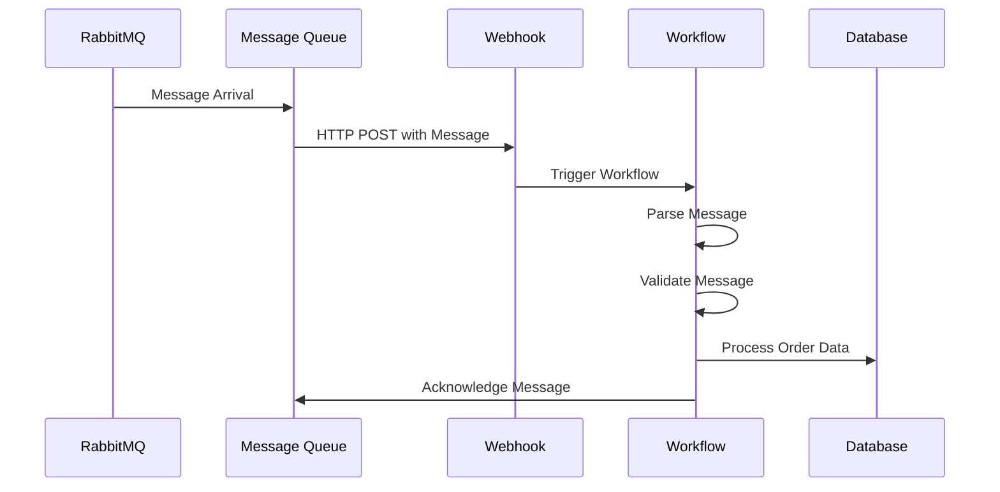

### Apache Kafka Stream Processing

```yaml
kafka-stream-pipeline:
  type: Workflow
  params:
    stream_data: dict
    topic_name: str
    partition_id: int

  on:
    message_queue:
      - queue_name: "user-events-topic"
        message_pattern: ".*user.*"
        source: "kafka"
        batch_size: 50
        visibility_timeout: 600
        dead_letter_queue: "failed-events"

  jobs:
    process-stream:
      stages:
        - name: "Consume Kafka Messages"
          uses: "kafka/consume_messages@latest"
          with:
            topic: "${{ params.topic_name }}"
            partition: "${{ params.partition_id }}"
            batch_size: 50

        - name: "Process User Events"
          uses: "processors/user_event_processor@latest"
          with:
            stream_data: "${{ stages.consume-kafka-messages.outputs.messages }}"

        - name: "Update User Analytics"
          uses: "analytics/user_analytics@latest"
          with:
            processed_events: "${{ stages.process-user-events.outputs.processed_data }}"

        - name: "Commit Offset"
          uses: "kafka/commit_offset@latest"
          with:
            topic: "${{ params.topic_name }}"
            partition: "${{ params.partition_id }}"
```

**Flow Trigger**: Apache Kafka → Stream Consumer → Webhook → Workflow

## Stream Processing Triggers

### Real-Time Analytics Pipeline

```yaml
real-time-analytics-pipeline:
  type: Workflow
  params:
    analytics_data: dict
    window_size: int
    aggregation_type: str

  on:
    stream_processing:
      - stream_name: "clickstream-events"
        window_size: 300
        aggregation_type: "count"
        source: "kafka"
        checkpoint_interval: 60
        watermark_delay: 30

    # Fallback schedule for batch processing
    schedule:
      - cron: "*/5 * * * *"  # Every 5 minutes
        timezone: "UTC"

  jobs:
    process-stream-window:
      stages:
        - name: "Collect Stream Window"
          uses: "streaming/collect_window@latest"
          with:
            stream_name: "clickstream-events"
            window_size: "${{ params.window_size }}"
            aggregation_type: "${{ params.aggregation_type }}"

        - name: "Calculate Real-Time Metrics"
          uses: "analytics/real_time_calculator@latest"
          with:
            window_data: "${{ stages.collect-stream-window.outputs.window_data }}"

        - name: "Update Dashboard"
          uses: "dashboard/update_metrics@latest"
          with:
            metrics: "${{ stages.calculate-real-time-metrics.outputs.metrics }}"

        - name: "Store to Time-Series DB"
          uses: "storage/timeseries_store@latest"
          with:
            metrics: "${{ stages.calculate-real-time-metrics.outputs.metrics }}"
            database: "influxdb"
```

**Flow Trigger**: Kafka Stream → Stream Processor → Webhook → Workflow

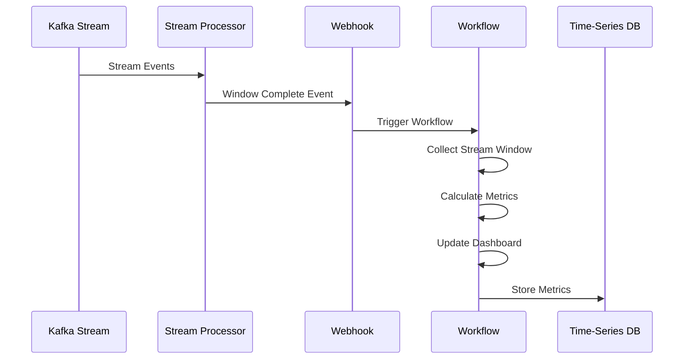

## Batch Processing Triggers

### Spark Job Completion Pipeline

```yaml
spark-batch-pipeline:
  type: Workflow
  params:
    job_id: str
    job_status: str
    output_path: str

  on:
    batch_processing:
      - job_name: "daily-data-processing"
        job_status: "completed"
        source: "spark"
        timeout_minutes: 180
        retry_count: 3
        dependencies: ["data-extraction", "data-validation"]

    # Fallback schedule
    schedule:
      - cron: "0 3 * * *"  # Daily at 3 AM
        timezone: "UTC"

  jobs:
    handle-batch-completion:
      stages:
        - name: "Validate Job Output"
          uses: "batch/validate_output@latest"
          with:
            job_id: "${{ params.job_id }}"
            output_path: "${{ params.output_path }}"

        - name: "Process Batch Results"
          uses: "batch/process_results@latest"
          with:
            validated_output: "${{ stages.validate-job-output.outputs.validated_data }}"

        - name: "Load to Data Warehouse"
          uses: "warehouse/load_batch_data@latest"
          with:
            processed_results: "${{ stages.process-batch-results.outputs.processed_data }}"

        - name: "Trigger Downstream Workflows"
          trigger: "analytics-workflow"
          params:
            batch_data: "${{ stages.process-batch-results.outputs.processed_data }}"
            job_id: "${{ params.job_id }}"
```

**Flow Trigger**: Spark Cluster → Job Monitor → Webhook → Workflow

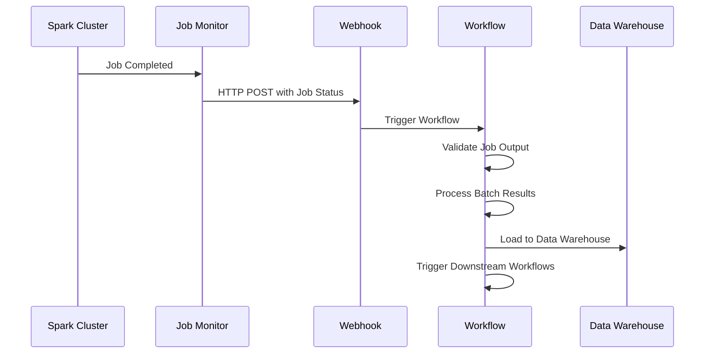

### EMR Job Orchestration

```yaml
emr-job-orchestration:
  type: Workflow
  params:
    cluster_id: str
    job_flow_id: str
    step_status: str

  on:
    batch_processing:
      - job_name: "emr-data-pipeline"
        job_status: "completed"
        source: "emr"
        timeout_minutes: 240
        retry_count: 2
        dependencies: ["s3-data-availability"]

  jobs:
    orchestrate-emr-jobs:
      stages:
        - name: "Check EMR Cluster Status"
          uses: "emr/check_cluster@latest"
          with:
            cluster_id: "${{ params.cluster_id }}"

        - name: "Validate Job Results"
          uses: "emr/validate_results@latest"
          with:
            job_flow_id: "${{ params.job_flow_id }}"

        - name: "Process EMR Output"
          uses: "emr/process_output@latest"
          with:
            validated_results: "${{ stages.validate-job-results.outputs.results }}"

        - name: "Terminate Cluster"
          uses: "emr/terminate_cluster@latest"
          with:
            cluster_id: "${{ params.cluster_id }}"

        - name: "Send Completion Notification"
          uses: "notifications/emr_completion@latest"
          with:
            cluster_id: "${{ params.cluster_id }}"
            job_flow_id: "${{ params.job_flow_id }}"
            status: "${{ params.step_status }}"
```

**Flow Trigger**: AWS EMR → CloudWatch Events → Webhook → Workflow

## File Monitoring Triggers

### Azure Storage Event Trigger

```yaml
azure-storage-triggered-etl:
  type: Workflow
  params:
    blob_url: str
    container_name: str
    file_name: str

  on:
    file:
      - path: "/data/incoming"
        pattern: "*.csv"
        event_type: "created"
        source: "azure-storage"
        debounce_seconds: 30

    # Fallback schedule
    schedule:
      - cron: "0 2 * * *"  # Daily at 2 AM
        timezone: "UTC"

  jobs:
    process-file:
      stages:
        - name: "Download from Azure"
          uses: "azure/download_blob@latest"
          with:
            blob_url: "${{ params.blob_url }}"
            container: "${{ params.container_name }}"
            file_name: "${{ params.file_name }}"

        - name: "Validate File"
          uses: "validation/check_csv@latest"
          with:
            file_path: "${{ stages.download-from-azure.outputs.local_path }}"

        - name: "Load to Database"
          uses: "etl/load_csv@latest"
          with:
            source: "${{ stages.download-from-azure.outputs.local_path }}"
            target: "warehouse.raw_data"

        - name: "Send Notification"
          uses: "notifications/send_alert@latest"
          with:
            message: "File processed successfully"
```

**Flow Trigger**: Azure Storage Account → Event Grid → Webhook → Workflow

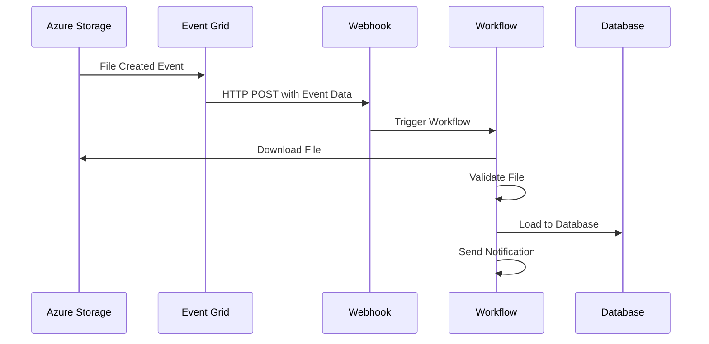

### AWS S3 Event Trigger

```yaml
s3-triggered-processor:
  type: Workflow
  params:
    bucket_name: str
    object_key: str
    event_type: str

  on:
    file:
      - path: "/data/raw"
        pattern: "*.json"
        event_type: "created"
        source: "aws-s3"
        recursive: false
        debounce_seconds: 60

  jobs:
    process-s3-object:
      stages:
        - name: "Get S3 Object"
          uses: "aws/get_s3_object@latest"
          with:
            bucket: "${{ params.bucket_name }}"
            key: "${{ params.object_key }}"

        - name: "Parse JSON Data"
          uses: "processors/json_parser@latest"
          with:
            data: "${{ stages.get-s3-object.outputs.content }}"

        - name: "Transform and Load"
          uses: "etl/transform_json@latest"
          with:
            data: "${{ stages.parse-json-data.outputs.parsed_data }}"
```

**Flow Trigger**: AWS S3 → S3 Event Notification → Lambda → Webhook → Workflow

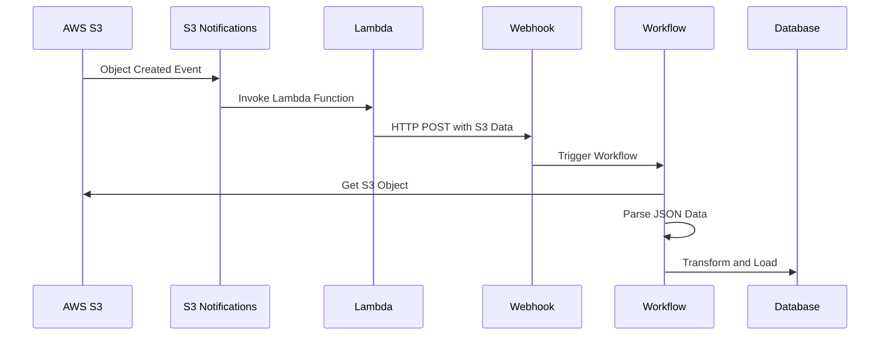

### Google Cloud Storage Event Trigger

```yaml
gcs-triggered-pipeline:
  type: Workflow
  params:
    bucket_name: str
    object_name: str

  on:
    file:
      - path: "/data/processed"
        pattern: "*.parquet"
        event_type: "created"
        source: "google-cloud-storage"
        debounce_seconds: 45

  jobs:
    process-gcs-file:
      stages:
        - name: "Download from GCS"
          uses: "gcp/download_from_gcs@latest"
          with:
            bucket: "${{ params.bucket_name }}"
            object: "${{ params.object_name }}"

        - name: "Process Parquet"
          uses: "processors/parquet_processor@latest"
          with:
            file_path: "${{ stages.download-from-gcs.outputs.local_path }}"
```

**Flow Trigger**: Google Cloud Storage → Cloud Functions → Pub/Sub → Webhook → Workflow

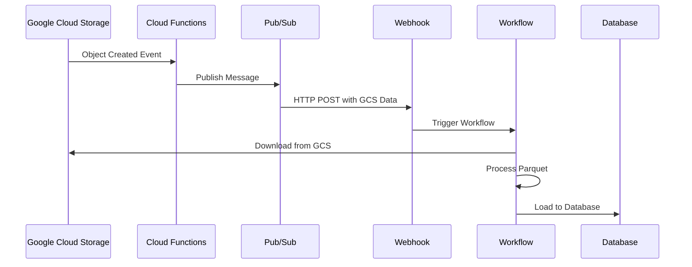

## Webhook Triggers

### External API Integration

```yaml
external-api-integration:
  type: Workflow
  params:
    api_data: dict
    source_system: str
    event_timestamp: datetime

  on:
    webhook:
      - endpoint: "/webhook/external-api"
        method: "POST"
        secret: "${{ env.WEBHOOK_SECRET }}"
        headers:
          "X-Source-System": "${{ env.SOURCE_SYSTEM_HEADER }}"
        timeout_seconds: 30

  jobs:
    validate-and-process:
      stages:
        - name: "Validate Webhook Data"
          run: |
            if not params.get('api_data'):
                raise Exception("No data received in webhook")

            # Validate required fields
            required_fields = ['source', 'timestamp', 'payload']
            for field in required_fields:
                if field not in params['api_data']:
                    raise Exception(f"Missing required field: {field}")

        - name: "Process API Data"
          uses: "processors/api_data_processor@latest"
          with:
            data: "${{ params.api_data }}"
            source: "${{ params.source_system }}"

        - name: "Store Results"
          uses: "storage/save_to_database@latest"
          with:
            data: "${{ stages.process-api-data.outputs.processed_data }}"
```

**Flow Trigger**: External API → HTTP POST → Webhook Endpoint → Workflow

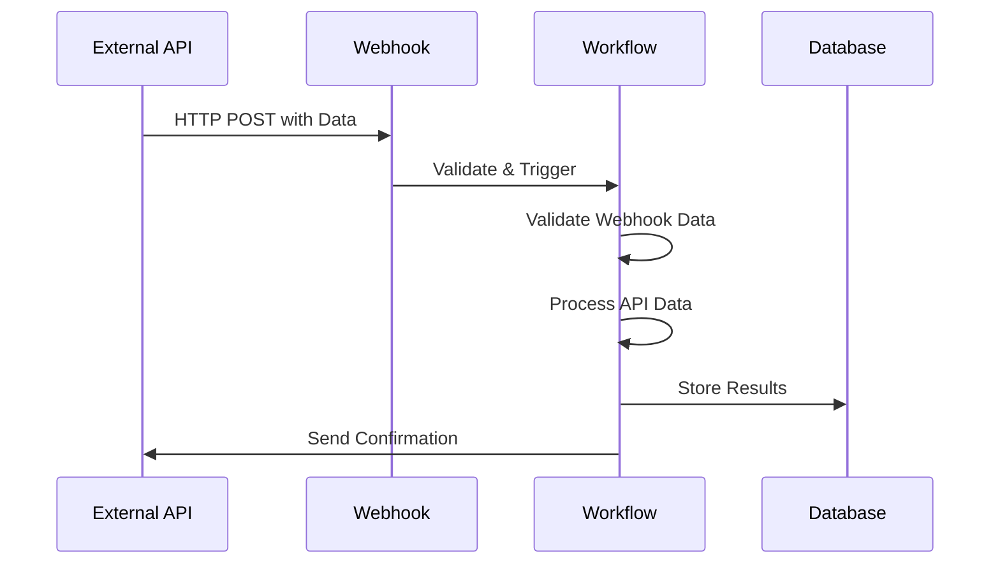

### Third-Party Service Integration

```yaml
third-party-integration:
  type: Workflow
  params:
    event_data: dict
    service_name: str

  on:
    webhook:
      - endpoint: "/webhook/salesforce"
        method: "POST"
        headers:
          "X-Salesforce-Signature": "${{ env.SF_SIGNATURE }}"
        timeout_seconds: 45

      - endpoint: "/webhook/shopify"
        method: "POST"
        headers:
          "X-Shopify-Hmac-Sha256": "${{ env.SHOPIFY_HMAC }}"
        timeout_seconds: 45

      - endpoint: "/webhook/zapier"
        method: "POST"
        timeout_seconds: 60

  jobs:
    route-by-service:
      stages:
        - name: "Route by Service"
          run: |
            service = params.get('service_name', 'unknown')
            if service == 'salesforce':
                result.outputs = {"processor": "salesforce-processor"}
            elif service == 'shopify':
                result.outputs = {"processor": "shopify-processor"}
            elif service == 'zapier':
                result.outputs = {"processor": "zapier-processor"}
            else:
                result.outputs = {"processor": "generic-processor"}

    process-event:
      needs: ["route-by-service"]
      stages:
        - name: "Process Event"
          trigger: "${{ stages.route-by-service.outputs.processor }}"
          params:
            event_data: "${{ params.event_data }}"
            source: "${{ params.service_name }}"
```

**Flow Trigger**: Third-Party Service → Webhook → Workflow

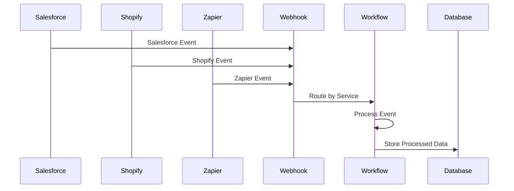

## Database Change Triggers

### Database Change Data Capture (CDC) Events

```yaml
database-cdc-pipeline:
  type: Workflow
  params:
    table_name: str
    change_data: dict
    operation_type: str

  on:
    database:
      - connection_string: "${{ env.DATABASE_URL }}"
        table: "user_events"
        operation: "insert"
        source: "debezium-cdc"
        check_interval_seconds: 0  # Real-time events

    # Fallback schedule
    schedule:
      - cron: "*/5 * * * *"  # Every 5 minutes
        timezone: "UTC"

  jobs:
    process-database-change:
      stages:
        - name: "Validate Change Data"
          run: |
            if not params.get('change_data'):
                raise Exception("No change data received")

            operation = params.get('operation_type')
            if operation not in ['insert', 'update', 'delete']:
                raise Exception(f"Invalid operation type: {operation}")

        - name: "Process Change"
          uses: "processors/cdc_processor@latest"
          with:
            change_data: "${{ params.change_data }}"
            operation: "${{ params.operation_type }}"
            table: "${{ params.table_name }}"

        - name: "Update Data Warehouse"
          uses: "warehouse/update_dimension@latest"
          with:
            changes: "${{ stages.process-change.outputs.processed_changes }}"
```

**Flow Trigger**: Database → Debezium CDC → Kafka → Webhook → Workflow

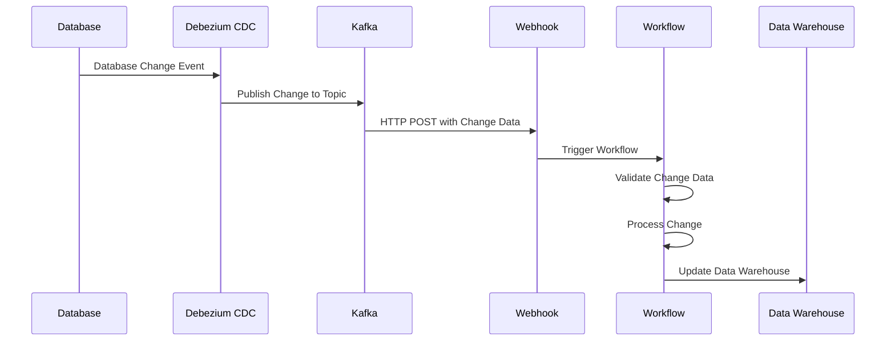

### Database Replication Events

```yaml
database-replication-pipeline:
  type: Workflow
  params:
    replication_data: dict
    source_database: str

  on:
    database:
      - connection_string: "${{ env.REPLICATION_DB_URL }}"
        table: "orders"
        operation: "update"
        source: "database-replication"
        check_interval_seconds: 0  # Real-time events

  jobs:
    sync-replication-data:
      stages:
        - name: "Process Replication Event"
          uses: "replication/process_event@latest"
          with:
            data: "${{ params.replication_data }}"
            source_db: "${{ params.source_database }}"

        - name: "Sync to Target"
          uses: "replication/sync_to_target@latest"
          with:
            processed_data: "${{ stages.process-replication-event.outputs.processed_data }}"
```

**Flow Trigger**: Source Database → Replication Service → Event Stream → Webhook → Workflow

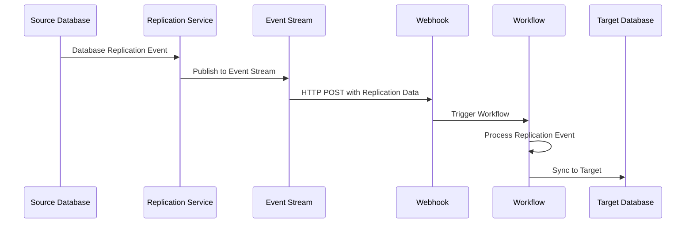

## Sensor-Based Triggers

### Monitoring System Alerts

```yaml
monitoring-alert-pipeline:
  type: Workflow
  params:
    alert_data: dict
    metric_name: str
    threshold_value: float

  on:
    sensor:
      - sensor_type: "system_metrics"
        threshold: 80.0
        operator: "gt"
        source: "prometheus-alertmanager"
        check_interval_seconds: 0  # Real-time alerts
        window_size: 300

  jobs:
    handle-system-alert:
      stages:
        - name: "Process Alert"
          uses: "monitoring/process_alert@latest"
          with:
            alert_data: "${{ params.alert_data }}"
            metric: "${{ params.metric_name }}"
            threshold: "${{ params.threshold_value }}"

        - name: "Send Notification"
          uses: "notifications/send_alert@latest"
          with:
            level: "warning"
            message: "System alert triggered"
            details: "${{ stages.process-alert.outputs.alert_details }}"

        - name: "Scale Resources"
          if: "${{ stages.process-alert.outputs.needs_scaling }}"
          uses: "infrastructure/auto_scale@latest"
          with:
            scaling_action: "${{ stages.process-alert.outputs.scaling_action }}"
```

**Flow Trigger**: Prometheus → AlertManager → Webhook → Workflow

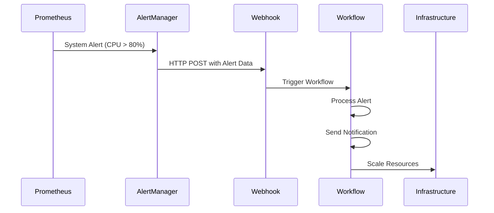

### Business Metrics Monitoring

```yaml
business-metrics-pipeline:
  type: Workflow
  params:
    metric_data: dict
    business_unit: str

  on:
    sensor:
      - sensor_type: "business_metrics"
        threshold: 1000
        operator: "lt"
        source: "datadog-monitoring"
        check_interval_seconds: 0  # Real-time alerts
        window_size: 3600

  jobs:
    handle-business-alert:
      stages:
        - name: "Analyze Business Metric"
          uses: "business/analyze_metric@latest"
          with:
            metric_data: "${{ params.metric_data }}"
            business_unit: "${{ params.business_unit }}"

        - name: "Send Business Alert"
          uses: "notifications/business_alert@latest"
          with:
            alert_type: "business_metric"
            details: "${{ stages.analyze-business-metric.outputs.analysis }}"

        - name: "Trigger Business Action"
          if: "${{ stages.analyze-business-metric.outputs.action_needed }}"
          uses: "business/trigger_action@latest"
          with:
            action: "${{ stages.analyze-business-metric.outputs.recommended_action }}"
```

**Flow Trigger**: DataDog → Monitoring → Webhook → Workflow

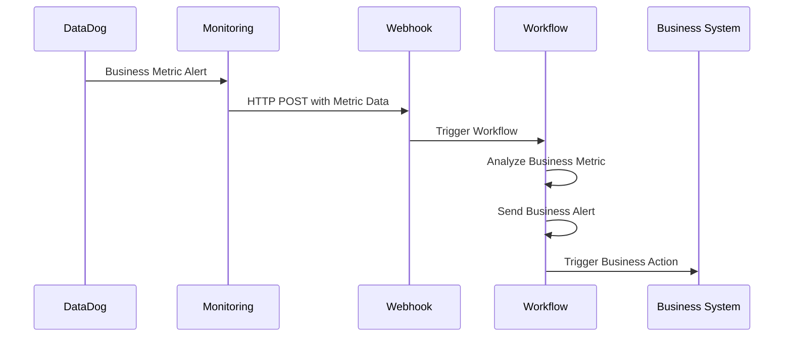

## Polling-Based Triggers

### Legacy System Integration

```yaml
legacy-system-polling:
  type: Workflow
  params:
    file_path: str
    file_size: int

  on:
    polling:
      - resource_type: "file"
        resource_path: "/data/legacy/input.csv"
        check_interval_seconds: 300  # Every 5 minutes
        condition: "file_size > 0"
        timeout_seconds: 30
        max_retries: 3

    # Fallback schedule
    schedule:
      - cron: "0 */2 * * *"  # Every 2 hours
        timezone: "UTC"

  jobs:
    process-legacy-file:
      stages:
        - name: "Check File Status"
          run: |
            import os
            file_path = params.get('file_path')
            if os.path.exists(file_path):
                file_size = os.path.getsize(file_path)
                result.outputs = {"file_size": file_size, "exists": True}
            else:
                result.outputs = {"file_size": 0, "exists": False}

        - name: "Process File"
          if: "${{ stages.check-file-status.outputs.exists }}"
          uses: "legacy/process_file@latest"
          with:
            file_path: "${{ params.file_path }}"
```

**Flow Trigger**: Workflow System → Poll File System → Check Condition → Execute


### Database Polling for Legacy Systems

```yaml
legacy-database-polling:
  type: Workflow
  params:
    table_name: str
    last_processed_id: int

  on:
    polling:
      - resource_type: "database"
        resource_path: "legacy_db.orders"
        check_interval_seconds: 180  # Every 3 minutes
        condition: "new_records_count > 0"
        timeout_seconds: 45
        max_retries: 2

  jobs:
    check-new-records:
      stages:
        - name: "Query New Records"
          run: |
            import psycopg2
            conn = psycopg2.connect(params.get('connection_string'))
            cursor = conn.cursor()

            cursor.execute("""
                SELECT COUNT(*) FROM orders
                WHERE id > %s AND created_at > NOW() - INTERVAL '1 hour'
            """, (params.get('last_processed_id'),))

            count = cursor.fetchone()[0]
            result.outputs = {"new_records_count": count}

        - name: "Process New Records"
          if: "${{ stages.query-new-records.outputs.new_records_count > 0 }}"
          uses: "legacy/process_orders@latest"
          with:
            last_id: "${{ params.last_processed_id }}"
```

**Flow Trigger**: Workflow System → Poll Database → Check Condition → Execute

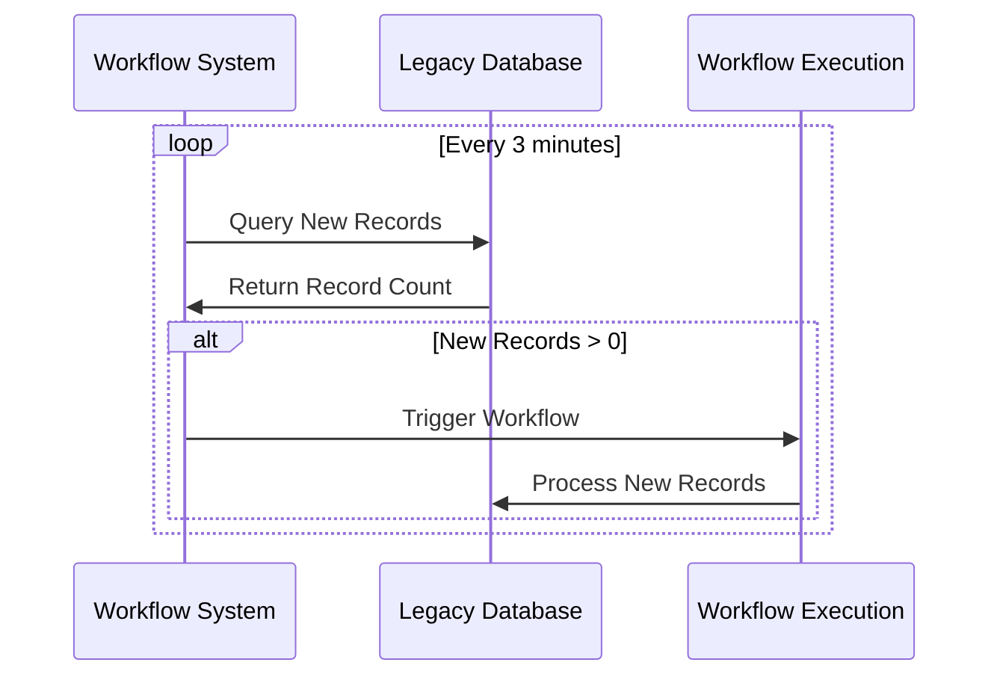

### API Polling for External Services

```yaml
api-polling-pipeline:
  type: Workflow
  params:
    api_endpoint: str
    api_key: str

  on:
    polling:
      - resource_type: "api"
        resource_path: "https://api.external-service.com/status"
        check_interval_seconds: 600  # Every 10 minutes
        condition: "status == 'ready'"
        timeout_seconds: 60
        max_retries: 3

  jobs:
    check-api-status:
      stages:
        - name: "Check API Status"
          run: |
            import requests

            response = requests.get(
                params.get('api_endpoint'),
                headers={'Authorization': f"Bearer {params.get('api_key')}"},
                timeout=30
            )

            if response.status_code == 200:
                data = response.json()
                result.outputs = {"status": data.get('status'), "data": data}
            else:
                raise Exception(f"API check failed: {response.status_code}")

        - name: "Process API Data"
          if: "${{ stages.check-api-status.outputs.status == 'ready' }}"
          uses: "api/process_data@latest"
          with:
            data: "${{ stages.check-api-status.outputs.data }}"
```

**Flow Trigger**: Workflow System → Poll API → Check Condition → Execute

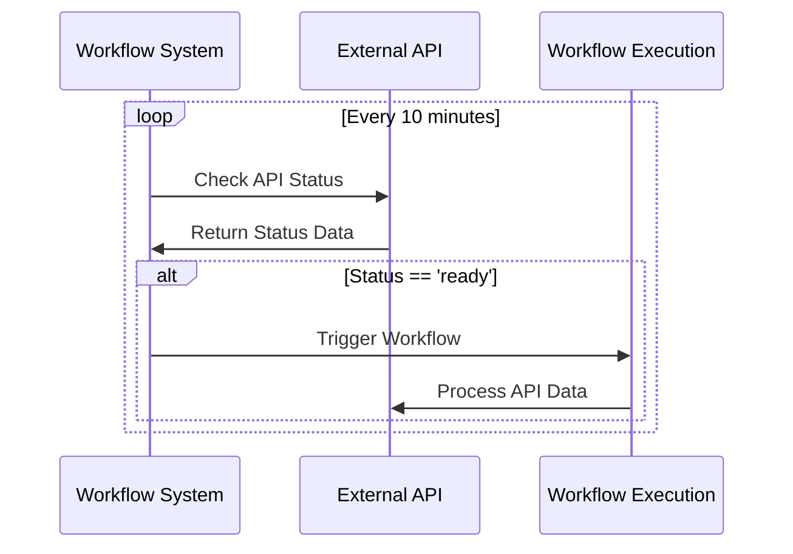

### Queue Monitoring

```yaml
queue-monitoring-pipeline:
  type: Workflow
  params:
    queue_name: str
    threshold: int

  on:
    polling:
      - resource_type: "queue"
        resource_path: "processing_queue"
        check_interval_seconds: 120  # Every 2 minutes
        condition: "queue_size > threshold"
        timeout_seconds: 30
        max_retries: 2

  jobs:
    monitor-queue:
      stages:
        - name: "Check Queue Size"
          run: |
            import redis

            r = redis.Redis(host='localhost', port=6379, db=0)
            queue_size = r.llen(params.get('queue_name'))

            result.outputs = {
                "queue_size": queue_size,
                "threshold": params.get('threshold'),
                "needs_processing": queue_size > params.get('threshold')
            }

        - name: "Scale Processing"
          if: "${{ stages.check-queue-size.outputs.needs_processing }}"
          uses: "infrastructure/scale_workers@latest"
          with:
            queue_size: "${{ stages.check-queue-size.outputs.queue_size }}"
```

**Flow Trigger**: Workflow System → Poll Queue → Check Condition → Execute

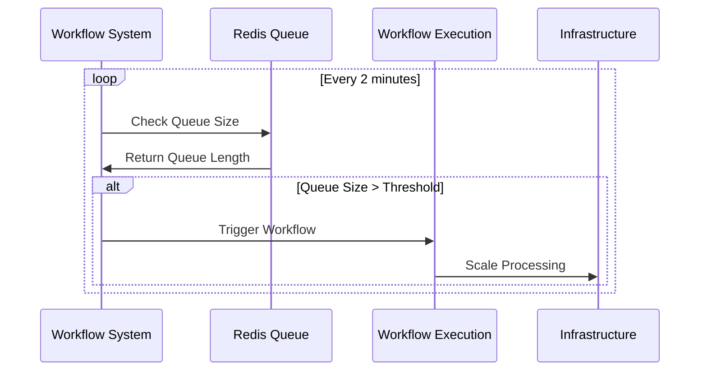

## Combined Trigger Scenarios

### Multi-Source Data Pipeline

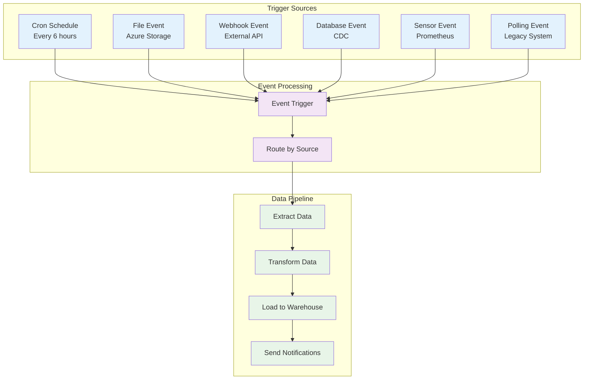

```yaml
multi-source-pipeline:
  type: Workflow
  params:
    trigger_source: str
    data_payload: dict

  on:
    # Time-based triggers
    schedule:
      - cron: "0 */6 * * *"  # Every 6 hours
        timezone: "UTC"

    # File-based triggers from cloud storage
    file:
      - path: "/data/priority"
        pattern: "urgent_*.csv"
        event_type: "created"
        source: "azure-storage"
        debounce_seconds: 10

    # Webhook triggers from external systems
    webhook:
      - endpoint: "/webhook/urgent-data"
        method: "POST"
        timeout_seconds: 15

    # Database triggers from CDC
    database:
      - connection_string: "${{ env.PRIORITY_DB_URL }}"
        table: "urgent_orders"
        operation: "insert"
        source: "debezium-cdc"
        check_interval_seconds: 0

    # Sensor triggers from monitoring
    sensor:
      - sensor_type: "queue_size"
        threshold: 1000
        operator: "gt"
        source: "prometheus-alertmanager"
        check_interval_seconds: 0
        window_size: 300

    # Polling triggers for legacy systems
    polling:
      - resource_type: "file"
        resource_path: "/data/legacy/backup.csv"
        check_interval_seconds: 3600  # Every hour
        condition: "file_size > 0"
        timeout_seconds: 30

  jobs:
    determine-trigger-source:
      stages:
        - name: "Analyze Trigger Source"
          run: |
            source = params.get('trigger_source', 'unknown')
            result.outputs = {"source": source}

    process-data:
      needs: ["determine-trigger-source"]
      stages:
        - name: "Extract Data"
          uses: "extractors/multi_source@latest"
          with:
            source: "${{ stages.analyze-trigger-source.outputs.source }}"
            data: "${{ params.data_payload }}"

        - name: "Transform Data"
          uses: "transformers/data_processor@latest"
          with:
            raw_data: "${{ stages.extract-data.outputs.extracted_data }}"

        - name: "Load Results"
          uses: "loaders/warehouse_loader@latest"
          with:
            processed_data: "${{ stages.transform-data.outputs.transformed_data }}"

        - name: "Send Notifications"
          uses: "notifications/completion_alert@latest"
          with:
            source: "${{ stages.analyze-trigger-source.outputs.source }}"
```

## Configuration Examples

### Environment-Specific Configuration

```python
from ddeutil.workflow import Event, FileEvent, WebhookEvent, DatabaseEvent, SensorEvent

# Development environment
dev_events = Event(
    file=[
        FileEvent(
            path="./data/test",
            pattern="*.csv",
            source="local-filesystem",
            debounce_seconds=5
        )
    ],
    webhook=[
        WebhookEvent(
            endpoint="/webhook/test",
            timeout_seconds=10
        )
    ]
)

# Production environment
prod_events = Event(
    file=[
        FileEvent(
            path="/data/production",
            pattern="*.csv",
            source="azure-storage",
            debounce_seconds=60,
            recursive=True
        )
    ],
    webhook=[
        WebhookEvent(
            endpoint="/webhook/production",
            secret="prod-secret-key",
            timeout_seconds=30
        )
    ],
    database=[
        DatabaseEvent(
            connection_string="postgresql://prod-db",
            table="orders",
            source="debezium-cdc",
            check_interval_seconds=0
        )
    ],
    sensor=[
        SensorEvent(
            sensor_type="system_health",
            threshold=90.0,
            operator="gt",
            source="prometheus-alertmanager",
            check_interval_seconds=0
        )
    ],
    polling=[
        PollingEvent(
            resource_type="file",
            resource_path="/data/legacy/backup.csv",
            check_interval_seconds=3600,
            condition="file_size > 0",
            timeout_seconds=30
        )
    ],
    message_queue=[
        MessageQueueEvent(
            queue_name="data-processing-queue",
            source="rabbitmq",
            batch_size=20,
            visibility_timeout=300
        )
    ],
    stream_processing=[
        StreamProcessingEvent(
            stream_name="clickstream-events",
            window_size=300,
            aggregation_type="count",
            source="kafka"
        )
    ],
    batch_processing=[
        BatchProcessingEvent(
            job_name="daily-data-processing",
            job_status="completed",
            source="spark",
            timeout_minutes=180
        )
    ]
)
```

## Event Trigger Flow Summary

### File Events
- **Azure Storage**: Storage Account → Event Grid → Webhook → Workflow
- **AWS S3**: S3 Bucket → S3 Event Notification → Lambda → Webhook → Workflow
- **Google Cloud Storage**: GCS Bucket → Cloud Functions → Pub/Sub → Webhook → Workflow

### Webhook Events
- **External APIs**: API Service → HTTP POST → Webhook Endpoint → Workflow
- **Third-Party Services**: Service → Webhook → Workflow

### Database Events
- **CDC**: Database → Debezium → Kafka → Webhook → Workflow
- **Replication**: Source DB → Replication Service → Event Stream → Webhook → Workflow

### Sensor Events
- **Monitoring Systems**: Prometheus → AlertManager → Webhook → Workflow
- **Business Metrics**: DataDog → Monitoring → Webhook → Workflow

### Polling Events
- **Legacy Systems**: Workflow System → Poll Resource → Check Condition → Execute
- **Fallback Mechanisms**: Workflow System → Poll External Service → Check Status → Execute

### Message Queue Events
- **RabbitMQ**: RabbitMQ → Message Queue → Webhook → Workflow
- **Apache Kafka**: Kafka → Stream Consumer → Webhook → Workflow
- **AWS SQS**: SQS → Lambda → Webhook → Workflow

### Stream Processing Events
- **Kafka Streams**: Kafka Stream → Stream Processor → Webhook → Workflow
- **Apache Flink**: Flink → Stream Job → Webhook → Workflow
- **AWS Kinesis**: Kinesis → Stream Processor → Webhook → Workflow

### Batch Processing Events
- **Apache Spark**: Spark Cluster → Job Monitor → Webhook → Workflow
- **AWS EMR**: EMR → CloudWatch Events → Webhook → Workflow
- **Azure HDInsight**: HDInsight → Job Monitor → Webhook → Workflow

### Complete Event Trigger Flow Diagram

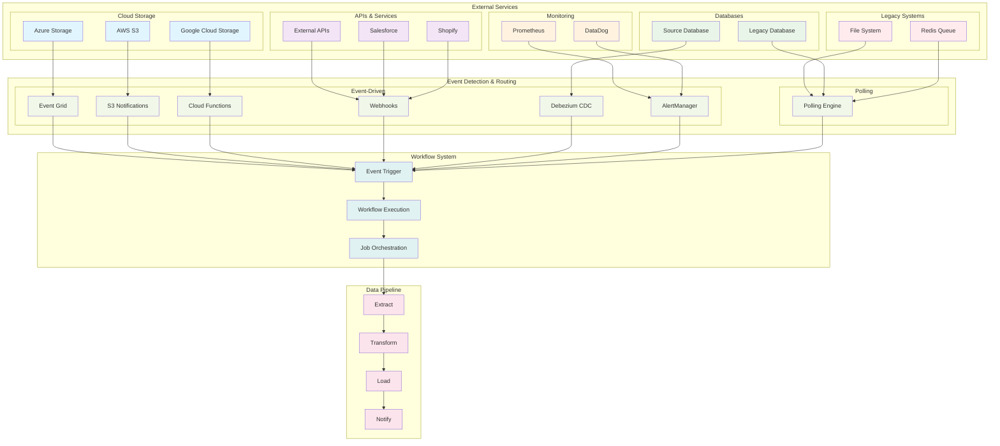

## Best Practices

### 1. Event Trigger Design

- **Use external services** to detect and trigger events, not internal polling
- **Implement proper authentication** for all webhook endpoints
- **Use debounce mechanisms** to prevent duplicate processing
- **Validate event sources** before processing

### 2. Performance Considerations

- **Limit the number of events** per workflow (see validation limits)
- **Use efficient event routing** to minimize processing overhead
- **Implement proper error handling** for all trigger types
- **Monitor event processing performance**

### 3. Security

- **Use secrets for webhook authentication**
- **Validate webhook signatures**
- **Implement proper access controls**
- **Secure all external service connections**

### 4. Monitoring

- **Track event trigger frequencies** to identify patterns
- **Monitor external service health** and availability
- **Set up alerts** for trigger failures
- **Log event processing** for debugging

## Validation Limits

The system enforces the following limits to prevent resource exhaustion:

- **Schedule events**: Maximum 10 per workflow
- **File events**: Maximum 20 per workflow
- **Webhook events**: Maximum 10 per workflow
- **Database events**: Maximum 5 per workflow
- **Sensor events**: Maximum 15 per workflow
- **Polling events**: Maximum 8 per workflow
- **Message queue events**: Maximum 5 per workflow
- **Stream processing events**: Maximum 3 per workflow
- **Batch processing events**: Maximum 5 per workflow

These limits ensure system stability while allowing for complex trigger configurations.

## Advanced Event Types and Scenarios

### Data Quality Event

**Example Trigger:**
```yaml
on:
  data_quality:
    - quality_metric: "completeness"
      threshold: 0.95
      operator: "lt"
      source: "great-expectations"
      dataset_name: "orders"
      validation_rules: ["no_nulls", "unique_id"]
      severity: "high"
```
**Scenarios:**
- Data fails a completeness check (e.g., missing values in required columns)
- Uniqueness constraint is violated in a key field
- Data accuracy drops below a business threshold
- Timeliness of data ingestion is not met

---

### API Rate Limit Event

**Example Trigger:**
```yaml
on:
  api_rate_limit:
    - api_name: "external-analytics-api"
      rate_limit_type: "requests_per_minute"
      current_usage: 98.5
      reset_time: 120
      source: "aws-api-gateway"
      retry_strategy: "exponential_backoff"
```
**Scenarios:**
- API usage approaches or exceeds quota
- Burst of requests triggers throttling
- Third-party API returns HTTP 429 Too Many Requests
- Scheduled batch jobs hit rate limits

---

### Data Lineage Event

**Example Trigger:**
```yaml
on:
  data_lineage:
    - lineage_type: "schema_change"
      source_dataset: "raw_orders"
      target_dataset: "clean_orders"
      transformation_type: "column_rename"
      source: "apache-atlas"
      impact_level: "medium"
      dependencies: ["raw_orders"]
```
**Scenarios:**
- Schema changes detected in upstream datasets
- New data flow or transformation is registered
- Data dependency is updated or removed
- Impact analysis shows downstream breakage risk

---

### ML Pipeline Event

**Example Trigger:**
```yaml
on:
  ml_pipeline:
    - pipeline_stage: "training"
      model_name: "churn-predictor"
      metric_name: "accuracy"
      threshold: 0.9
      operator: "lt"
      source: "mlflow"
      model_version: "v1.2.3"
      drift_detected: false
```
**Scenarios:**
- Model training completes (success or failure)
- Model accuracy drops below threshold
- Model drift is detected in production
- New model version is deployed

---

### Data Catalog Event

**Example Trigger:**
```yaml
on:
  data_catalog:
    - catalog_event_type: "metadata_update"
      dataset_name: "customer_profiles"
      metadata_type: "schema"
      source: "aws-glue-catalog"
      governance_level: "confidential"
      tags: ["pii", "customer"]
```
**Scenarios:**
- Metadata is updated for a dataset (e.g., schema, tags)
- New dataset is discovered in the catalog
- Governance policy changes for a dataset
- Access request is made for restricted data

---

### Infrastructure Event

**Example Trigger:**
```yaml
on:
  infrastructure:
    - infrastructure_type: "compute"
      event_type: "scaling"
      resource_name: "etl-worker-group"
      current_utilization: 92.0
      threshold: 90.0
      source: "cloudwatch"
      scaling_action: "scale_up"
```
**Scenarios:**
- Compute resource utilization exceeds threshold
- Auto-scaling event is triggered
- Infrastructure failure or maintenance event
- Cost optimization recommendation is issued

---

### Compliance Event

**Example Trigger:**
```yaml
on:
  compliance:
    - compliance_type: "audit"
      regulation_name: "GDPR"
      audit_scope: "data-retention"
      source: "compliance-monitor"
      deadline: 30
      severity: "critical"
```
**Scenarios:**
- Scheduled or ad-hoc audit is required
- Regulatory change is detected (e.g., new law)
- Data retention policy deadline is approaching
- Privacy or security incident is reported

---

### Business Event

**Example Trigger:**
```yaml
on:
  business:
    - business_event_type: "business_hours"
      business_unit: "finance"
      event_time: "2024-07-01T09:00:00Z"
      source: "business-calendar"
      priority: "high"
      business_rules: ["end_of_quarter", "reporting"]
```
**Scenarios:**
- Start or end of business hours triggers workflow
- Seasonal campaign or holiday event
- Business rule or policy change
- End-of-quarter or reporting period
