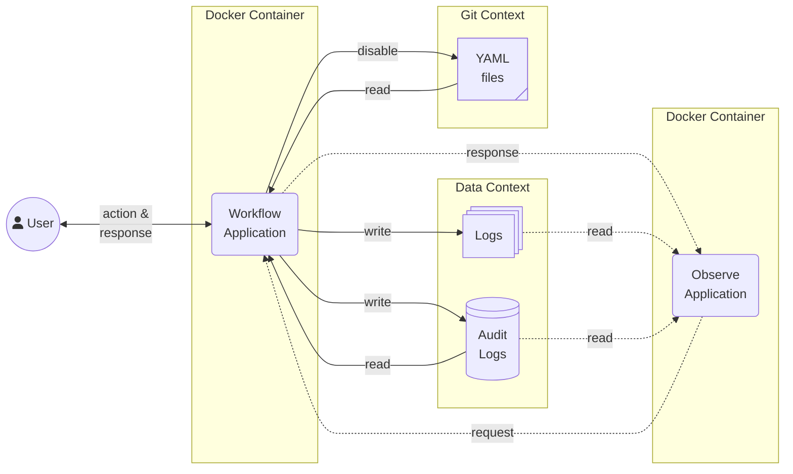

# :person_running: Workflow

The **Lightweight Workflow Orchestration** with fewer dependencies the was created
for easy to make a simple metadata driven data workflow. It can use for data operator
by a `.yaml` template.

!!! warning

    This package provide only orchestration workload task. That mean you should not
    use the workflow stage to process any large volume data which use lot of compute
    resource. :cold_sweat:

In my opinion, I think it should not create duplicate workflow codes if I can
write with dynamic input parameters on the one template workflow that just change
the input parameters per use-case instead.
This way I can handle a lot of logical workflows in our orgs with only metadata
configuration. It called **Metadata Driven Data Workflow**.

---

**:pushpin: <u>Rules of This Workflow engine</u>**:

1. The Minimum frequency unit of scheduling is **1 minute** :warning:
2. Can not re-run only failed stage and its pending downstream :rotating_light:
3. All parallel tasks inside workflow engine use Multi-Threading
   (Python 3.13 unlock GIL :unlock:)

---

**:memo: <u>Workflow Diagrams</u>**:

This diagram show where is this application run on the production infrastructure.
You will see that this application do only running code with stress-less which mean
you should to set the data layer separate this core program before run this application.



!!! note

    _Disclaimer_: I inspire the dynamic statement from the [**GitHub Action**](https://github.com/features/actions)
    with `.yml` files and all of config file from several data orchestration framework
    tools from my experience on Data Engineer. :grimacing:

    Other workflow that I interest on them and pick some interested feature to this
    package:

    - [Google **Workflows**](https://cloud.google.com/workflows)
    - [AWS **Step Functions**](https://aws.amazon.com/step-functions/)

## :round_pushpin: Installation

This project need `ddeutil-io` extension namespace packages. If you want to install
this package with application add-ons, you should add `app` in installation;

| Usecase        | Install Optional                         | Support            |
|----------------|------------------------------------------|--------------------|
| Python         | `pip install ddeutil-workflow`           | :heavy_check_mark: |
| FastAPI Server | `pip install ddeutil-workflow[api]`      | :heavy_check_mark: |

## :beers: Usage

This is examples that use workflow file for running common Data Engineering
use-case.

!!! important

    I recommend you to use the `call` stage for all actions that you want to do
    with workflow activity that you want to orchestrate. Because it able to dynamic
    an input argument with the same call function that make you use less time to
    maintenance your data workflows.

```yaml
run-py-local:

   # Validate model that use to parsing exists for template file
   type: Workflow
   on:
      # If workflow deploy to schedule, it will run every 5 minutes
      # with Asia/Bangkok timezone.
      - cronjob: '*/5 * * * *'
        timezone: "Asia/Bangkok"
   params:
      # Incoming execution parameters will validate with this type. It allows
      # to set default value or templating.
      source-extract: str
      run-date: datetime
   jobs:
      getting-api-data:
         stages:
            - name: "Retrieve API Data"
              id: retrieve-api
              uses: tasks/get-api-with-oauth-to-s3@requests
              with:
                 # Arguments of source data that want to retrieve.
                 method: post
                 url: https://finances/open-data/currency-pairs/
                 body:
                    resource: ${{ params.source-extract }}

                    # You can use filtering like Jinja template but this
                    # package does not use it.
                    filter: ${{ params.run-date | fmt(fmt='%Y%m%d') }}
                 auth:
                    type: bearer
                    keys: ${API_ACCESS_REFRESH_TOKEN}

                 # Arguments of target data that want to land.
                 writing_mode: flatten
                 aws_s3_path: my-data/open-data/${{ params.source-extract }}

                 # This Authentication code should implement with your custom call
                 # function. The template allow you to use environment variable.
                 aws_access_client_id: ${AWS_ACCESS_CLIENT_ID}
                 aws_access_client_secret: ${AWS_ACCESS_CLIENT_SECRET}
```

The above workflow template is main executor pipeline that you want to do. If you
want to schedule this workflow, you want to dynamic its parameters change base on
execution time such as `run-date` should change base on that workflow running date.

```python
from ddeutil.workflow import Workflow, Result

workflow: Workflow = Workflow.from_loader('run-py-local')
result: Result = workflow.execute(
   params={"source-extract": "USD-THB", "asat-dt": "2024-01-01"}
)
```

So, this package provide the `Schedule` template for this action, and you can dynamic
pass the parameters for changing align with that running time by the `release` prefix.

```yaml
schedule-run-local-wf:

   # Validate model that use to parsing exists for template file
   type: Schedule
   workflows:

      # Map existing workflow that want to deploy with scheduler application.
      # It allows you to pass release parameter that dynamic change depend on the
      # current context of this scheduler application releasing that time.
      - name: run-py-local
        params:
          source-extract: "USD-THB"
          asat-dt: "${{ release.logical_date }}"
```

The main method of the `Schedule` model that use to running is `pending`. If you
do not pass the `stop` date on this method, it will use config with `WORKFLOW_APP_STOP_BOUNDARY_DELTA`
key for generate this stop date.

```python
from ddeutil.workflow import Schedule

(
   Schedule
   .from_loader("schedule-run-local-wf")
   .pending(stop=None)
)
```

!!! example

   For more examples, this workflow can use with these scenarios:

   - Extract metadata (1 ~ 15 MB per request) from external API every 15 minutes
   - Sensor data on S3 and send that data to Azure Service Bus every minute
