# :person_running: Workflow

The **Lightweight Workflow Orchestration** with fewer dependencies the was created
for easy to make a simple metadata driven data workflow. It can use for data operator
by a `.yaml` template.

!!! warning

    This package provide only orchestration workload task. That mean you should not
    use the workflow stage to process any large volume data which use lot of compute
    resource. :cold_sweat:

---

**:pushpin: <u>Rules of This Workflow engine</u>**:

1. The Minimum frequency unit of built-in scheduling is **1 Minute** 🕘
2. **Can not** re-run only failed stage and its pending downstream ↩️
3. All parallel tasks inside workflow core engine use **Multi-Threading** pool
   (Python 3.13 unlock GIL 🐍🔓)

---

**:memo: <u>Workflow Diagrams</u>**:

This diagram show where is this application run on the production infrastructure.
You will see that this application do only running code with stress-less which mean
you should to set the data layer separate this core program before run this application.

```mermaid
flowchart LR
    A((fa:fa-user User))

    subgraph Docker Container
        direction TB
        G@{ shape: rounded, label: "📡Observe<br>Application" }
    end

    subgraph Docker Container
        direction TB
        B@{ shape: rounded, label: "🏃Workflow<br>Application" }
    end

    A <-->|action &<br>response| B
    B -...-> |response| G
    G -...-> |request| B

    subgraph Data Context
        D@{ shape: processes, label: "Logs" }
        E@{ shape: lin-cyl, label: "Audit<br>Logs" }
    end

    subgraph Config Context
        F@{ shape: tag-rect, label: "YAML<br>files" }
    end

    A ---> |push| H(Repo)
    H -.-> |pull| F

    B <-->|disable &<br>read| F

    B <-->|read &<br>write| E

    B -->|write| D

    D -.->|read| G
    E -.->|read| G
```



!!! note

    _**Disclaimer**_: I inspire the dynamic YAML statement from the [**GitHub Action**](https://github.com/features/actions),
    and my experience of data framework configs pattern. :grimacing:

    Other workflow orchestration services that I interest and pick them to be
    this project inspiration:

    - [Google **Workflows**](https://cloud.google.com/workflows)
    - [AWS **Step Functions**](https://aws.amazon.com/step-functions/)

## :round_pushpin: Installation

This project need `ddeutil` and `ddeutil-io` extension namespace packages to be
the base deps.
If you want to install this package with application add-ons, you should add
`app` in installation;

| Use-case       | Install Optional                         |       Support       |
|----------------|------------------------------------------|:-------------------:|
| Python         | `pip install ddeutil-workflow`           | :heavy_check_mark:  |
| FastAPI Server | `pip install ddeutil-workflow[api]`      | :heavy_check_mark:  |

## 🎯 Usage

This is examples that use workflow file for running common Data Engineering
use-case.

!!! important

    I recommend you to use the `call` stage for all actions that you want to do
    with workflow activity that you want to orchestrate. Because it able to dynamic
    an input argument with the same call function that make you use less time to
    maintenance your data workflows.

```yaml
run-py-local:

   # Validate model that use to parsing exists for template file
   type: Workflow
   on:
      # If workflow deploy to schedule, it will run every 5 minutes
      # with Asia/Bangkok timezone.
      - cronjob: '*/5 * * * *'
        timezone: "Asia/Bangkok"
   params:
      # Incoming execution parameters will validate with this type. It allows
      # to set default value or templating.
      source-extract: str
      run-date: datetime
   jobs:
      getting-api-data:
         runs-on:
            type: local
         stages:
            - name: "Retrieve API Data"
              id: retrieve-api
              uses: tasks/get-api-with-oauth-to-s3@requests
              with:
                 # Arguments of source data that want to retrieve.
                 method: post
                 url: https://finances/open-data/currency-pairs/
                 body:
                    resource: ${{ params.source-extract }}

                    # You can use filtering like Jinja template but this
                    # package does not use it.
                    filter: ${{ params.run-date | fmt(fmt='%Y%m%d') }}
                 auth:
                    type: bearer
                    keys: ${API_ACCESS_REFRESH_TOKEN}

                 # Arguments of target data that want to land.
                 writing_mode: flatten
                 aws:
                    path: my-data/open-data/${{ params.source-extract }}

                    # This Authentication code should implement with your custom call
                    # function. The template allow you to use environment variable.
                    access_client_id: ${AWS_ACCESS_CLIENT_ID}
                    access_client_secret: ${AWS_ACCESS_CLIENT_SECRET}
```

Before execute this workflow, you should implement caller function first.

```text
registry-caller/
  ╰─ tasks.py
```

This function will store as module that will import from `WORKFLOW_CORE_REGISTRY_CALLER`
value (This config can override by extra parameters with `registry_caller` key).

```python
from ddeutil.workflow import Result, tag
from ddeutil.workflow.errors import StageError
from pydantic import BaseModel, SecretStr


class AwsCredential(BaseModel):
    path: str
    access_client_id: str
    access_client_secret: SecretStr


class RestAuth(BaseModel):
    type: str
    keys: SecretStr


@tag("requests", alias="get-api-with-oauth-to-s3")
def get_api_with_oauth_to_s3(
     method: str,
     url: str,
     body: dict[str, str],
     auth: RestAuth,
     writing_node: str,
     aws: AwsCredential,
     result: Result,
) -> dict[str, int]:
    """Get the data from RestAPI via Authenticate with OAuth and then store to
    AWS S3 service.
    """
    result.trace.info("[CALLER]: Start get data via RestAPI to S3.")
    result.trace.info(f"... {method}: {url}")
    if method != "post":
        raise StageError(f"RestAPI does not support for {method} action.")
    # NOTE: If you want to use secret, you can use `auth.keys.get_secret_value()`.
    return {"records": 1000}
```

The above workflow template is main executor pipeline that you want to do. If you
want to schedule this workflow, you want to dynamic its parameters change base on
execution time such as `run-date` should change base on that workflow running date.

```python
from ddeutil.workflow import Workflow, Result

workflow: Workflow = Workflow.from_conf('run-py-local')
result: Result = workflow.execute(
   params={"source-extract": "USD-THB", "run-date": "2024-01-01"}
)
```
