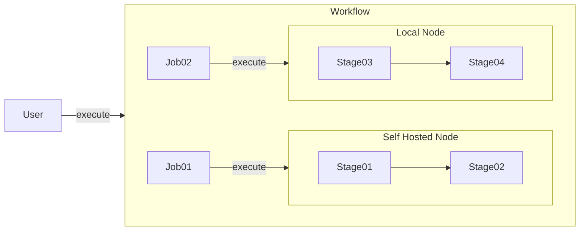

# Introduction

A workflow template handle multiple job template that able to run on any compute
node. That is mean a workflow can run job on multiple different nodes.

The core models of this package is `Workflow`, `Job`, and `Stage`.
The other models is used to deploy these models.
